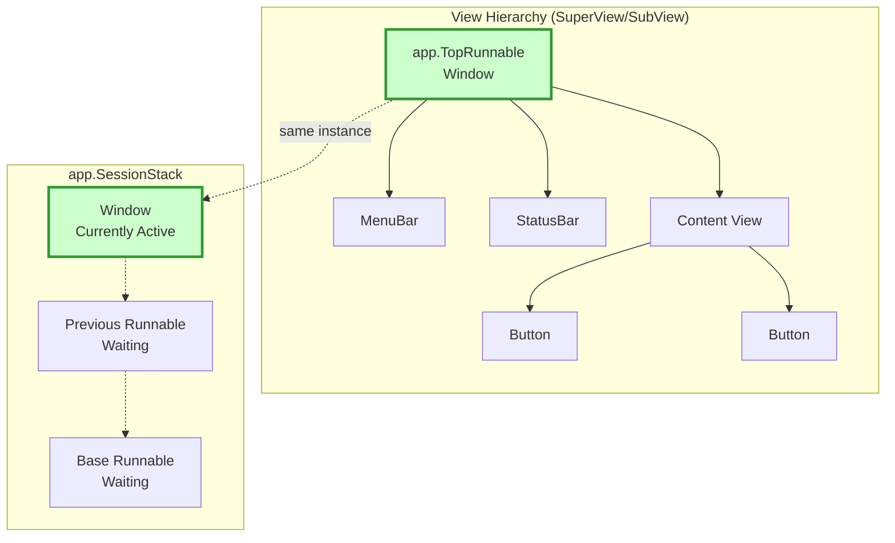
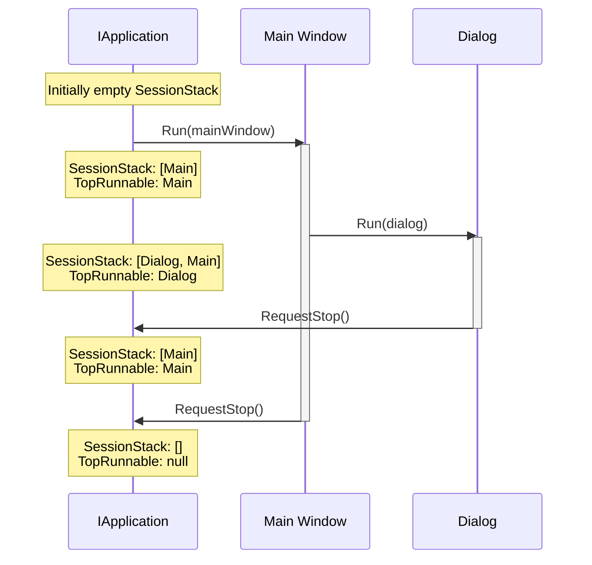

# Application Architecture

Terminal.Gui v2 uses an instance-based application architecture that decouples views from the global application state, enabling multiple application contexts, providing type-safe result handling, enabling testability.

## Key Features

- **Instance-Based**: Use `Application.Create()` to get an `IApplication` instance instead of static methods
- **IRunnable Interface**: Views implement `IRunnable<TResult>` to participate in session management without inheriting from `Runnable`
- **Fluent API**: Chain `Init()` and `Run()` for elegant, concise code  
- **IDisposable Pattern**: Proper resource cleanup with `Dispose()` or `using` statements
- **Automatic Disposal**: Framework-created runnables are automatically disposed
- **Type-Safe Results**: Generic `TResult` parameter provides compile-time type safety
- **CWP Compliance**: All lifecycle events follow the Cancellable Work Pattern

## View Hierarchy and Run Stack



## Usage Example Flow



## Key Concepts

### Instance-Based vs Static

**Terminal.Gui v2** supports both static and instance-based patterns. The static `Application` class is marked obsolete but still functional for backward compatibility. The recommended pattern is to use `Application.Create()` to get an `IApplication` instance:

```csharp
// RECOMMENDED (v2 - instance-based with using statement):
using (IApplication app = Application.Create ().Init ())
{
    Window top = new ();
    top.Add (myView);
    app.Run (top);
    top.Dispose ();
} // app.Dispose() called automatically

// WITH IRunnable (fluent API with automatic disposal):
using (IApplication app = Application.Create ().Init ())
{
    app.Run<ColorPickerDialog> ();
    Color? result = app.GetResult<Color> ();
}

// ALTERNATIVE (manual disposal):
IApplication app = Application.Create ().Init ();
app.Run<ColorPickerDialog> ();
Color? result = app.GetResult<Color> ();
app.Dispose ();

// OLD (v1 / early v2 - obsolete, avoid in new code):
Application.Init ();
Window top = new ();
top.Add (myView);
Application.Run (top);
top.Dispose ();
Application.Shutdown (); // Obsolete - use Dispose() instead
```

**Note:** The static `Application` class delegates to a singleton instance accessible via `Application.Instance`. `Application.Create()` creates a **new** application instance, enabling multiple application contexts and better testability.

### View.App Property

Every view now has an `App` property that references its application context:

```csharp
public class View
{
    /// <summary>
    /// Gets the application context for this view.
    /// </summary>
    public IApplication? App { get; internal set; }
    
    /// <summary>
    /// Gets the application context, checking parent hierarchy if needed.
    /// Override to customize application resolution.
    /// </summary>
    public virtual IApplication? GetApp () => App ?? SuperView?.GetApp ();
}
```

**Benefits:**
- Views can be tested without `Application.Init()`
- Multiple applications can coexist
- Clear ownership: views know their context
- Reduced global state dependencies

### Accessing Application from Views

```csharp
public class MyView : View
{
    public override void OnEnter (View view)
    {
        // Use View.App instead of obsolete static Application
        IApplication? app = App;
        app?.TopRunnable?.SetNeedsDraw ();
        
        // Access SessionStack
        if (app?.SessionStack?.Count > 0)
        {
            // Work with sessions
        }
    }
}
```

## IRunnable Architecture

Terminal.Gui v2 introduces the **IRunnable** interface pattern that decouples runnable behavior from the `Runnable` class hierarchy. Views can implement `IRunnable<TResult>` to participate in session management without inheritance constraints.

### Key Benefits

- **Interface-Based**: No forced inheritance from `Runnable`
- **Type-Safe Results**: Generic `TResult` parameter provides compile-time type safety
- **Fluent API**: Method chaining for elegant, concise code
- **Automatic Disposal**: Framework manages lifecycle of created runnables
- **CWP Compliance**: All lifecycle events follow the Cancellable Work Pattern

### Fluent API Pattern

The fluent API enables elegant method chaining with automatic resource management:

```csharp
// Recommended: using statement with GetResult
using (IApplication app = Application.Create ().Init ())
{
    app.Run<ColorPickerDialog> ();
    Color? result = app.GetResult<Color> ();
    
    if (result is { })
    {
        ApplyColor (result);
    }
}

// Alternative: Manual disposal
IApplication app = Application.Create ().Init ();
app.Run<ColorPickerDialog> ();
Color? result = app.GetResult<Color> ();
app.Dispose ();

if (result is { })
{
    ApplyColor (result);
}
```

**Key Methods:**

- `Init()` - Returns `IApplication` for chaining
- `Run<TRunnable>()` - Creates and runs runnable, returns `IApplication`
- `GetResult()` / `GetResult<T>()` - Extract typed result after run
- `Dispose()` - Release all resources (called automatically with `using`)

### Disposal Semantics

**"Whoever creates it, owns it":**

| Method | Creator | Owner | Disposal |
|--------|---------|-------|----------|
| `Run<TRunnable>()` | Framework | Framework | Automatic when `Run<T>()` returns |
| `Run(IRunnable)` | Caller | Caller | Manual by caller |

```csharp
// Framework ownership - automatic disposal
using (IApplication app = Application.Create ().Init ())
{
    app.Run<MyDialog> (); // Dialog disposed automatically when Run returns
    MyResultType? result = app.GetResult<MyResultType> ();
}

// Caller ownership - manual disposal
using (IApplication app = Application.Create ().Init ())
{
    MyDialog dialog = new ();
    app.Run (dialog);
    MyResultType? result = dialog.Result;
    dialog.Dispose ();  // Caller must dispose
}
```

**NOTE**: The semantics of `view.Add (subView)` is such that ownership of the `subView` is controlled by `view` unless `view.Remove (subView)` is explicitly called.

### Creating Runnable Views

Derive from `Runnable<TResult>` or implement `IRunnable<TResult>`:

```csharp
public class FileDialog : Runnable<string?>
{
    private TextField _pathField;
    
    public FileDialog ()
    {
        Title = "Select File";
        
        _pathField = new () { X = 1, Y = 1, Width = Dim.Fill (1) };
        
        Button okButton = new () { Text = "OK", IsDefault = true };
        okButton.Accepting += (s, e) =>
        {
            Result = _pathField.Text;
            App?.RequestStop ();
        };
        
        Add (_pathField, okButton);
    }
    
    protected override bool OnIsRunningChanging (bool oldValue, bool newValue)
    {
        if (!newValue)  // Stopping - extract result before disposal
        {
            Result = _pathField?.Text;
        }
        return base.OnIsRunningChanging (oldValue, newValue);
    }
}
```

### Lifecycle Properties

- **`IsRunning`** - True when runnable is on `SessionStack`
- **`IsModal`** - True when runnable is at top of stack (capturing all input)
- **`Result`** - Typed result value set before stopping

### Lifecycle Events (CWP-Compliant)

All events follow Terminal.Gui's Cancellable Work Pattern:

| Event | Cancellable | When | Use Case |
|-------|-------------|------|----------|
| `IsRunningChanging` | ✓ | Before add/remove from stack | Extract result, prevent close |
| `IsRunningChanged` | ✗ | After stack change | Post-start/stop cleanup |
| `IsModalChanged` | ✗ | After modal state change | Update UI after focus change |

**Example - Result Extraction:**

```csharp
protected override bool OnIsRunningChanging (bool oldValue, bool newValue)
{
    if (!newValue)  // Stopping
    {
        // Extract result before views are disposed
        Result = _colorPicker.SelectedColor;
        
        // Optionally cancel stop (e.g., unsaved changes)
        if (HasUnsavedChanges ())
        {
            int? response = MessageBox.Query ("Save?", "Save changes?", "_No", "_Yes");
            
            if (response is null or 0)
            {
                return true;  // Cancel stop
            }

            if (response == 1)
            {
                Save ();
            }
        }
    }
    
    return base.OnIsRunningChanging (oldValue, newValue);
}
```

### SessionStack

The `SessionStack` manages all running `IRunnable` sessions:

```csharp
public interface IApplication
{
    /// <summary>
    /// Stack of running IRunnable sessions.
    /// Each entry is a SessionToken wrapping an IRunnable.
    /// </summary>
    ConcurrentStack<SessionToken>? SessionStack { get; }
    
    /// <summary>
    /// The IRunnable at the top of SessionStack (currently modal).
    /// </summary>
    IRunnable? TopRunnable { get; }
}
```

**Stack Behavior:**

- Push: `Begin(IRunnable)` adds to top of stack
- Pop: `End(SessionToken)` removes from stack
- Peek: `TopRunnable` returns current modal runnable
- All: `SessionStack` enumerates all running sessions

## IApplication Interface

The `IApplication` interface defines the application contract with support for both legacy `Runnable` and modern `IRunnable` patterns:

```csharp
public interface IApplication
{
    // IRunnable support (primary)
    IRunnable? TopRunnable { get; }
    View? TopRunnableView { get; }
    ConcurrentStack<SessionToken>? SessionStack { get; }
    
    // Driver and lifecycle
    IDriver? Driver { get; }
    IMainLoopCoordinator? Coordinator { get; }
    
    // Fluent API methods  
    IApplication Init (string? driverName = null);
    void Dispose (); // IDisposable
    
    // Runnable methods
    SessionToken? Begin (IRunnable runnable);
    object? Run (IRunnable runnable, Func<Exception, bool>? errorHandler = null);
    IApplication Run<TRunnable> (Func<Exception, bool>? errorHandler = null) where TRunnable : IRunnable, new();
    void RequestStop (IRunnable? runnable);
    void End (SessionToken sessionToken);
    
    // Result extraction
    object? GetResult ();
    T? GetResult<T> () where T : class;
    
    // ... other members
}
```

## Terminology Changes

Terminal.Gui v2 modernized its terminology for clarity:

### Application.TopRunnable (formerly "Current", and before that "Top")

The `TopRunnable` property represents the `IRunnable` on the top of the session stack (the active runnable session):

```csharp
// Access the top runnable session
IRunnable? topRunnable = app.TopRunnable;

// From within a view  
IRunnable? topRunnable = App?.TopRunnable;

// Cast to View if needed
View? topView = app.TopRunnableView;
```

**Why "TopRunnable"?**
- Clearly indicates it's the top of the runnable session stack
- Aligns with the IRunnable architecture
- Distinguishes from other concepts like "Current" which could be ambiguous
- Works with any view that implements `IRunnable`, not just `Runnable`

### Application.SessionStack (formerly "Runnables")

The `SessionStack` property is the stack of running sessions:

```csharp
// Access all running sessions
foreach (SessionToken runnable in app.SessionStack)
{
    // Process each session
}

// From within a view
var sessionCount = App?.SessionStack.Count ?? 0;
```

**Why "SessionStack" instead of "Runnables"?**
- Describes both content (sessions) and structure (stack)
- Aligns with `SessionToken` terminology
- Follows .NET naming patterns (descriptive + collection type)

## Migration from Static Application

The static `Application` class delegates to a singleton instance and is marked obsolete. All static methods and properties are marked with `[Obsolete]` but remain functional for backward compatibility:

```csharp
public static partial class Application
{
    [Obsolete ("The legacy static Application object is going away.")]
    public static View? TopRunnableView => Instance.TopRunnableView;
    
    [Obsolete ("The legacy static Application object is going away.")]
    public static IRunnable? TopRunnable => Instance.TopRunnable;
    
    [Obsolete ("The legacy static Application object is going away.")]
    public static ConcurrentStack<SessionToken>? SessionStack => Instance.SessionStack;
    
    // ... other obsolete static members
}
```

**Important:** The static `Application` class uses a singleton (`Application.Instance`), while `Application.Create()` creates new instances. For new code, prefer the instance-based pattern using `Application.Create()`.

### Migration Strategies

**Strategy 1: Use View.App**

```csharp
// OLD:
void MyMethod ()
{
    Application.TopRunnable?.SetNeedsDraw ();
}

// NEW:
void MyMethod (View view)
{
    view.App?.TopRunnableView?.SetNeedsDraw ();
}
```

**Strategy 2: Pass IApplication**

```csharp
// OLD:
void ProcessSessions ()
{
    foreach (SessionToken runnable in Application.SessionStack)
    {
        // Process
    }
}

// NEW:
void ProcessSessions (IApplication app)
{
    foreach (SessionToken runnable in app.SessionStack)
    {
        // Process
    }
}
```

**Strategy 3: Store IApplication Reference**

```csharp
public class MyService
{
    private readonly IApplication _app;
    
    public MyService (IApplication app)
    {
        _app = app;
    }
    
    public void DoWork ()
    {
        _app.TopRunnable?.Title = "Processing...";
    }
}
```

## Resource Management and Disposal

Terminal.Gui v2 implements the `IDisposable` pattern for proper resource cleanup. Applications must be disposed after use to:
- Stop the input thread cleanly
- Release driver resources
- Prevent thread leaks in tests
- Free unmanaged resources

### Using the `using` Statement (Recommended)

```csharp
// Automatic disposal with using statement
using (IApplication app = Application.Create ().Init ())
{
    app.Run<MyDialog> ();
    // app.Dispose() automatically called when scope exits
}
```

### Manual Disposal

```csharp
// Manual disposal
IApplication app = Application.Create ();
try
{
    app.Init ();
    app.Run<MyDialog> ();
}
finally
{
    app.Dispose (); // Ensure cleanup even if exception occurs
}
```

### Dispose() and Result Retrieval

- **`Dispose()`** - Standard IDisposable pattern for resource cleanup (required)
- **`GetResult()`** / **`GetResult<T>()`** - Retrieve results after run completes
- **`Shutdown()`** - Obsolete (use `Dispose()` instead)

```csharp
// RECOMMENDED (using statement):
using (IApplication app = Application.Create ().Init ())
{
    app.Run<MyDialog> ();
    MyResult? result = app.GetResult<MyResult> ();
    // app.Dispose() called automatically here
}

// ALTERNATIVE (manual disposal):
IApplication app = Application.Create ().Init ();
app.Run<MyDialog> ();
MyResult? result = app.GetResult<MyResult> ();
app.Dispose (); // Must call explicitly

// OLD (obsolete - do not use):
object? result = app.Run<MyDialog> ().Shutdown ();
```

### Input Thread Lifecycle

When calling `Init()`, Terminal.Gui starts a dedicated input thread that continuously polls for console input. This thread must be stopped properly:

```csharp
using Terminal.Gui.Drivers;

IApplication app = Application.Create ();
app.Init (DriverRegistry.Names.ANSI); // Input thread starts here

// Input thread runs in background at ~50 polls/second (20ms throttle)

app.Dispose (); // Cancels input thread and waits for it to exit
```

**Important for Tests**: Always dispose applications in tests to prevent thread leaks:

```csharp
using Terminal.Gui.Drivers;

[Fact]
public void My_Test ()
{
    using IApplication app = Application.Create ();
    app.Init (DriverRegistry.Names.ANSI);
    
    // Test code here
    
    // app.Dispose() called automatically
}
```

### Singleton Re-initialization

The legacy static `Application` singleton can be re-initialized after disposal (for backward compatibility with old tests):

```csharp
// Test 1
Application.Init ();
Application.Shutdown (); // Obsolete but still works for legacy singleton

// Test 2 - singleton resets and can be re-initialized
Application.Init (); // ✅ Works!
Application.Shutdown (); // Obsolete but still works for legacy singleton
```

However, instance-based applications follow standard `IDisposable` semantics and cannot be reused after disposal:

```csharp
IApplication app = Application.Create ();
app.Init ();
app.Dispose ();

app.Init (); // ❌ Throws ObjectDisposedException
```

## Session Management

### Begin and End

Applications manage sessions through `Begin()` and `End()`:

```csharp
using IApplication app = Application.Create ();
app.Init ();

Window window = new ();

// Begin a new session - pushes to SessionStack
SessionToken? token = app.Begin (window);

// TopRunnable now points to this window
Debug.Assert (app.TopRunnable == window);

// End the session - pops from SessionStack
if (token != null)
{
    app.End (token);
}

// TopRunnable restored to previous runnable (if any)
```

### Nested Sessions

Multiple sessions can run nested:

```csharp
using IApplication app = Application.Create ();
app.Init ();

// Session 1
Window main = new () { Title = "Main" };
SessionToken? token1 = app.Begin (main);
// app.TopRunnable == main, SessionStack.Count == 1

// Session 2 (nested)
Dialog dialog = new () { Title = "Dialog" };
SessionToken? token2 = app.Begin (dialog);
// app.TopRunnable == dialog, SessionStack.Count == 2

// End dialog
app.End (token2);
// app.TopRunnable == main, SessionStack.Count == 1

// End main
app.End (token1);
// app.TopRunnable == null, SessionStack.Count == 0
```

## Driver Management

### Discovering Available Drivers

Terminal.Gui provides AOT-friendly methods to discover available drivers through the **Driver Registry**:

```csharp
// Get all registered driver names (no reflection)
IEnumerable<string> driverNames = Application.GetRegisteredDriverNames();

foreach (string name in driverNames)
{
    Debug.WriteLine($"Available driver: {name}");
}
// Output:
// Available driver: dotnet
// Available driver: windows
// Available driver: unix
// Available driver: ansi

// Get detailed driver information with metadata
foreach (var descriptor in Application.GetRegisteredDrivers())
{
    Debug.WriteLine($"{descriptor.Name}: {descriptor.DisplayName}");
    Debug.WriteLine($"  Description: {descriptor.Description}");
    Debug.WriteLine($"  Platforms: {string.Join(", ", descriptor.SupportedPlatforms)}");
}

// Validate a driver name (useful for CLI argument validation)
if (Application.IsDriverNameValid(userInput))
{
    app.Init(driverName: userInput);
}
else
{
    Console.WriteLine($"Invalid driver: {userInput}");
    Console.WriteLine($"Valid options: {string.Join(", ", Application.GetRegisteredDriverNames())}");
}
```

**Type-Safe Constants:**

Use `DriverRegistry.Names` for compile-time type safety:

```csharp
using Terminal.Gui.Drivers;

// Type-safe driver names
string ansi = DriverRegistry.Names.ANSI;      // "ansi"
string windows = DriverRegistry.Names.WINDOWS; // "windows"
string unix = DriverRegistry.Names.UNIX;       // "unix"
string dotnet = DriverRegistry.Names.DOTNET;   // "dotnet"

app.Init(driverName: DriverRegistry.Names.ANSI);
```

**Note**: The legacy `GetDriverTypes()` method is now obsolete. Use `GetRegisteredDriverNames()` or `GetRegisteredDrivers()` instead for AOT-friendly, reflection-free driver discovery. See [Drivers](drivers.md) for complete Driver Registry documentation.

### ForceDriver Configuration Property

The `ForceDriver` property is a configuration property that allows you to specify which driver to use. It can be set via code or through the configuration system (e.g., `config.json`):

```csharp
using Terminal.Gui.Drivers;

// RECOMMENDED: Set on instance with type-safe constant
using (IApplication app = Application.Create ())
{
    app.ForceDriver = DriverRegistry.Names.ANSI;
    app.Init ();
}

// ALTERNATIVE: Set with string
using (IApplication app = Application.Create ())
{
    app.ForceDriver = "ansi";
    app.Init ();
}

// LEGACY: Set on static Application (obsolete)
Application.ForceDriver = DriverRegistry.Names.DOTNET;
Application.Init ();
```

**Valid driver names**: `"dotnet"`, `"windows"`, `"unix"`, `"ansi"`

For complete driver documentation including the Driver Registry pattern, see [Drivers](drivers.md).

### ForceDriverChanged Event

The static `Application.ForceDriverChanged` event is raised when the `ForceDriver` property changes:

```csharp
using Terminal.Gui.Drivers;

// ForceDriverChanged event (on legacy static Application)
Application.ForceDriverChanged += (sender, e) =>
{
    Debug.WriteLine ($"Driver changed from '{e.OldValue}' to '{e.NewValue}'");
};

Application.ForceDriver = DriverRegistry.Names.ANSI;
```

## View.Driver Property

Similar to `View.App`, views now have a `Driver` property for accessing driver functionality.

```csharp
public override void OnDrawContent (Rectangle viewport)
{
    // Use view's driver instead of obsolete Application.Driver
    Driver?.Move (0, 0);
    Driver?.AddStr ("Hello");
}
```

**Note**: See [Drivers Deep Dive](drivers.md) for complete driver architecture details, including the organized interface structure with lifecycle, components, display, rendering, cursor, and input regions.

## Testing with the New Architecture

The instance-based architecture dramatically improves testability:

### Testing Views in Isolation

```csharp
[Fact]
public void MyView_DisplaysCorrectly ()
{
    // Create mock application
    Mock<IApplication> mockApp = new ();
    Runnable runnable = new ();
    mockApp.Setup (a => a.TopRunnable).Returns (runnable);
    
    // Create view with mock app
    MyView view = new () { App = mockApp.Object };
    
    // Test without Application.Init()!
    view.SetNeedsDraw ();
    Assert.True (view.NeedsDraw);
    
    // No disposal needed for mock!
}
```

### Testing with Real Application

```csharp
using Terminal.Gui.Drivers;

[Fact]
public void MyView_WorksWithRealApplication ()
{
    using (IApplication app = Application.Create ())
    {
        app.Init (DriverRegistry.Names.ANSI);
        
        MyView view = new ();
        Window top = new ();
        top.Add (view);
        
        SessionToken? token = app.Begin (top);
        
        // View.App automatically set
        Assert.NotNull (view.App);
        Assert.Same (app, view.App);
        
        // Test view behavior
        view.DoSomething ();
        
        if (token is { })
        {
            app.End (token);
        }
    }
}
```

## Best Practices

### DO: Use View.App

```csharp
// ✅ GOOD - Use View.App (modern instance-based pattern):
public void Refresh ()
{
    App?.TopRunnableView?.SetNeedsDraw ();
}
```

### DON'T: Use Static Application

```csharp
// ❌ AVOID - Obsolete static Application:
public void Refresh ()
{
    Application.TopRunnableView?.SetNeedsDraw (); // Obsolete!
}
```

### DO: Pass IApplication as Dependency

```csharp
// ✅ GOOD - Dependency injection:
public class Service
{
    private readonly IApplication _app;
    
    public Service (IApplication app)
    {
        _app = app;
    }
}
```

### DON'T: Use Static Application in New Code

```csharp
// ❌ AVOID - Obsolete static Application in new code:
public void Refresh ()
{
    Application.TopRunnableView?.SetNeedsDraw (); // Obsolete!
}

// ✅ PREFERRED - Use View.App property:
public void Refresh ()
{
    App?.TopRunnableView?.SetNeedsDraw ();
}
```

## Advanced Scenarios

### Multiple Applications

The instance-based architecture enables multiple applications:

```csharp
using Terminal.Gui.Drivers;

// Application 1
using (IApplication app1 = Application.Create ())
{
    app1.Init (DriverRegistry.Names.ANSI);
    Window top1 = new () { Title = "App 1" };
    // ... configure and run top1
}

// Application 2 (different driver!)
using (IApplication app2 = Application.Create ())
{
    app2.Init (DriverRegistry.Names.ANSI);
    Window top2 = new () { Title = "App 2" };
    // ... configure and run top2
}

// Views in top1 use app1
// Views in top2 use app2
```

## See Also

- [Navigation](navigation.md) - Navigation with the instance-based architecture
- [Keyboard](keyboard.md) - Keyboard handling through View.App
- [Mouse](mouse.md) - Mouse handling through View.App  
- [Drivers](drivers.md) - Driver access through View.Driver
- [Multitasking](multitasking.md) - Session management with SessionStack
