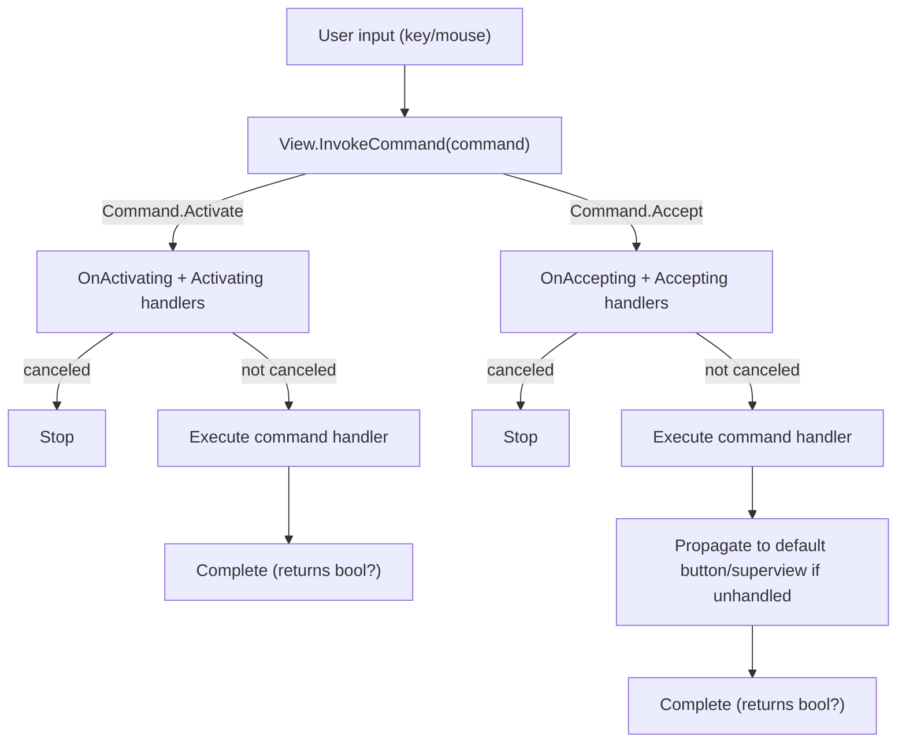
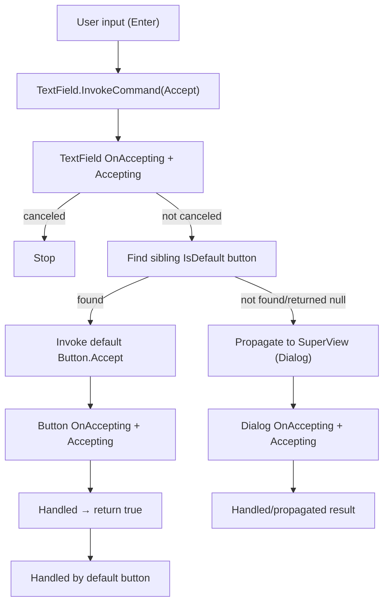
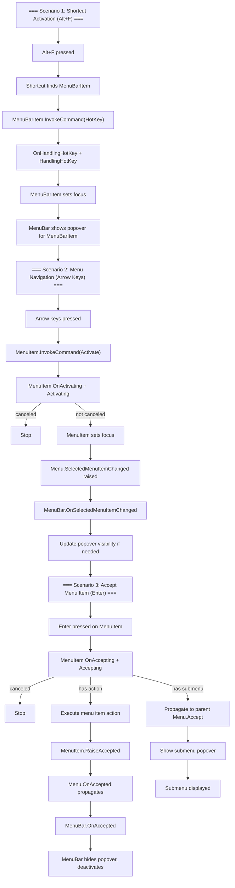

### Level 1: Basic View Command Flow

This diagram shows the fundamental command invocation flow within a single view, demonstrating the Cancellable Work Pattern with pre-events (e.g., `Activating`, `Accepting`) and the command handler execution.

**Key Points:**
- Commands follow the Cancellable Work Pattern: pre-event → virtual method → event → handler
- `OnActivating`/`OnAccepting` or event handlers can cancel via `args.Cancel = true`
- Command handlers return `bool?`: `null` (no handler), `false` (executed but unhandled), `true` (handled/canceled)
- `Command.Activate` is handled locally (no propagation)
- `Command.Accept` may propagate (see Level 2)

### Level 2: Accept Propagation with Button.IsDefault

This diagram shows how `Command.Accept` propagates through the view hierarchy, including the special case where a default button intercepts the command even when invoked from another view.

**Key Points:**
- `Command.Accept` checks for a sibling `Button` with `IsDefault = true` in the `SuperView`
- If found and not the source view, the default button handles the command first
- If unhandled or no default button, command propagates to `SuperView`
- `SuperView` (e.g., `Dialog`) can handle accept to close or trigger actions
- This enables Enter key to activate default buttons from any focused view

### Level 3: Complete Flow with Shortcut, MenuBar, and Menu

This diagram illustrates the complete command flow in a complex hierarchical scenario involving `Shortcut`, `MenuBar`, `Menu`, and `MenuItem`, showing how commands route through multiple views and how `Accepted` events propagate back up the hierarchy.

**Key Points:**
- **Scenario 1 (HotKey)**: Shortcut activates menu bar item via `Command.HotKey`, which sets focus and triggers MenuBar to show the popover
- **Scenario 2 (Activate)**: Arrow keys navigate menu items via `Command.Activate`, which is handled locally but raises `SelectedMenuItemChanged` for MenuBar coordination
- **Scenario 3 (Accept)**: Enter key executes menu items via `Command.Accept`, followed by `Accepted` event propagating up (MenuItem → Menu → MenuBar) to close menus
- `Command.Activate` doesn't propagate but uses view-specific event (`SelectedMenuItemChanged`) for hierarchical coordination
- `Accepted` is a post-event (not part of Cancellable Work Pattern pre-event phase) that signals action completion
- MenuBar uses `SelectedMenuItemChanged` to manage popover visibility, demonstrating current workaround for lack of generic `Activate` propagation
