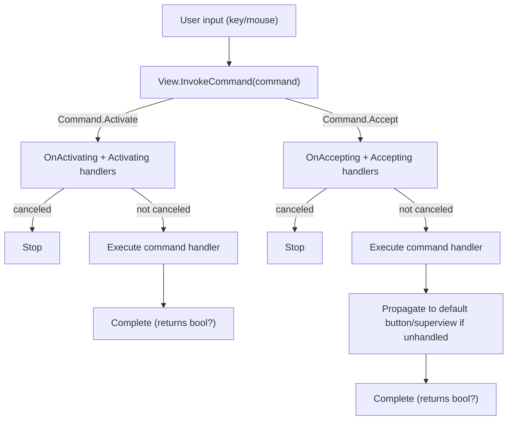

# Deep Dive into Command and View.Command in Terminal.Gui

## See Also

* [Lexicon & Taxonomy](lexicon.md)
* [Cancellable Work Pattern](cancellable-work-pattern.md)
* [Events](events.md)

## Overview

The `Command` system in Terminal.Gui provides a standardized framework for defining and executing actions that views can perform, such as selecting items, accepting input, or navigating content. Implemented primarily through the `View.Command` APIs, this system integrates tightly with input handling (e.g., keyboard and mouse events) and leverages the *Cancellable Work Pattern* to ensure extensibility, cancellation, and decoupling. Central to this system are the `Activating` and `Accepting` events, which encapsulate common user interactions: `Activating` for changing a view’s state or preparing it for interaction (e.g., toggling a checkbox, focusing a menu item), and `Accepting` for confirming an action or state (e.g., executing a menu command, accepting a ListView, submitting a dialog).

This deep dive explores the `Command` and `View.Command` APIs, focusing on the `Activating` and `Accepting` concepts, their implementation, and their propagation behavior. It critically evaluates the need for additional events (`Activated`/`Accepted`) and the propagation of `Activating` events, drawing on insights from `Menu`, `MenuItem`, `MenuBar`, `CheckBox`, and `FlagSelector`. These implementations highlight the system’s application in hierarchical (menus) and stateful (checkboxes, flag selectors) contexts. The document reflects the current implementation, including the `Cancel` property in `CommandEventArgs` and local handling of `Command.Activate`. An appendix briefly summarizes proposed changes from a filed issue noting the rename from `Command.Select` to `Command.Activate` has been completed, replace `Cancel` with `Handled`, and introduce a propagation mechanism, addressing limitations in the current system.

This diagram shows the fundamental command invocation flow within a single view, demonstrating the Cancellable Work Pattern with pre-events (e.g., `Activating`, `Accepting`) and the command handler execution.



## Command System Summary

| Aspect | `Command.Activate` | `Command.Accept` |
|--------|-------------------|------------------|
| **Semantic Meaning** | "Interact with this view / select an item" - changes view state or prepares for interaction | "Perform the view's primary action" - confirms action or accepts current state |
| **Typical Triggers** | • Spacebar<br>• Single mouse click<br>• Navigation keys (arrows)<br>• Mouse enter (menus) | • Enter key<br>• Double-click (via framework or application timing) |
| **Event Name** | `Activating` | `Accepting` |
| **Virtual Method** | `OnActivating` | `OnAccepting` |
| **Propagation** | (Current Behavior; See [#4473](https://github.com/gui-cs/Terminal.Gui/issues/4473)) **Local only** - No propagation to superview<br>Relies on view-specific events (e.g., `SelectedMenuItemChanged`) | (Current Behavior; See [#4473](https://github.com/gui-cs/Terminal.Gui/issues/4473)) - **Hierarchical** - Propagates to:<br>• Default button (`IsDefault = true`)<br>• Superview<br>• SuperMenuItem (menus) |
| **Post-Event** | None (use view-specific events like `CheckedStateChanged`, `SelectedMenuItemChanged`) | `Accepted` (in `Menu`, `MenuBar` - not in base `View`) |
| **Example: Button** | Sets focus (if `CanFocus`)<br>No state change | Invokes button's primary action (e.g., submit dialog) |
| **Example: CheckBox** | Toggles `CheckedState` (spacebar) | Confirms current `CheckedState` (Enter) |
| **Example: ListView** | Selects item (single click, navigation) | Opens/enters selected item (double-click or Enter) |
| **Example: Menu/MenuBar** | Focuses `MenuItem` (arrow keys, mouse enter)<br>Raises `SelectedMenuItemChanged` | Executes command / opens submenu (Enter)<br>Raises `Accepted` to close menu |
| **Mouse → Command Pipeline** | See [Mouse Pipeline](mouse.md#complete-mouse-event-pipeline)<br>**Current:** `LeftButtonClicked` → `Activate`<br>**Recommended:** `LeftButtonClicked` → `Activate` (first click)<br>`LeftButtonDoubleClicked` → `Accept` (framework-provided) | See [Mouse Pipeline](mouse.md#complete-mouse-event-pipeline)<br>**Current:** Applications track timing manually<br>**Recommended:** `LeftButtonDoubleClicked` → `Accept` |
| **Return Value Semantics** | `null`: no handler<br>`false`: executed but not handled<br>`true`: handled/canceled | Same as Activate |
| **Current Limitation** | No generic propagation mechanism for hierarchical views | Relies on view-specific logic (e.g., `SuperMenuItem`) instead of generic propagation |
| **Proposed Enhancement** | [#4473](https://github.com/gui-cs/Terminal.Gui/issues/4473) | Standardize propagation via subscription model instead of special properties |

### Key Takeaways

1. **`Activate` = Interaction/Selection** (immediate, local)
   - Changes view state or sets focus
   - Does NOT propagate to SuperView
   - Views can emit view-specific events for notification (e.g., `CheckedStateChanged`, `SelectedMenuItemChanged`)

2. **`Accept` = Confirmation/Action** (final, hierarchical)
   - Confirms current state or executes primary action
   - DOES propagate to default button or SuperView
   - Enables dialog/menu close scenarios

## Overview of the Command System

The `Command` system in Terminal.Gui defines a set of standard actions via the `Command` enum (e.g., `Command.Activate`, `Command.Accept`, `Command.HotKey`, `Command.StartOfPage`). These actions are triggered by user inputs (e.g., key presses, mouse clicks) or programmatically, enabling consistent view interactions.

### Key Components
- **Command Enum**: Defines actions like `Select` (state change or interaction preparation), `Accept` (action confirmation), `HotKey` (hotkey activation), and others (e.g., `StartOfPage` for navigation).
- **Command Handlers**: Views register handlers using `View.AddCommand`, specifying a `CommandImplementation` delegate that returns `bool?` (`null`: no command executed; `false`: executed but not handled; `true`: handled or canceled).
- **Command Routing**: Commands are invoked via `View.InvokeCommand`, executing the handler or raising `CommandNotBound` if no handler exists.
- **Cancellable Work Pattern**: Command execution uses events (e.g., `Activating`, `Accepting`) and virtual methods (e.g., `OnActivating`, `OnAccepting`) for modification or cancellation, with `Cancel` indicating processing should stop.

### Role in Terminal.Gui
The `Command` system bridges user input and view behavior, enabling:
- **Consistency**: Standard commands ensure predictable interactions (e.g., `Enter` triggers `Accept` in buttons, menus, checkboxes).
- **Extensibility**: Custom handlers and events allow behavior customization.
- **Decoupling**: Events reduce reliance on sub-classing, though current propagation mechanisms may require subview-superview coordination.

### Note on `Cancel` Property
The `CommandEventArgs` class uses a `Cancel` property to indicate that a command event (e.g., `Accepting`) should stop processing. This is misleading, as it implies action negation rather than completion. A filed issue proposes replacing `Cancel` with `Handled` to align with input events (e.g., `Key.Handled`). This document uses `Cancel` to reflect the current implementation, with the appendix summarizing the proposed change.

## Implementation in View.Command

The `View.Command` APIs in the `View` class provide infrastructure for registering, invoking, and routing commands, adhering to the *Cancellable Work Pattern*.

### Command Registration
Views register commands using `View.AddCommand`, associating a `Command` with a `CommandImplementation` delegate. The delegate’s `bool?` return controls processing flow.

**Example**: Default commands in `View.SetupCommands`:
```csharp
private void SetupCommands()
{
    AddCommand(Command.Accept, RaiseAccepting);
    AddCommand(Command.Activate, ctx =>
    {
        if (RaiseActivating(ctx) is true)
        {
            return true;
        }
        if (CanFocus)
        {
            SetFocus();
            return true;
        }
        return false;
    });
    AddCommand(Command.HotKey, () =>
    {
        if (RaiseHandlingHotKey() is true)
        {
            return true;
        }
        SetFocus();
        return true;
    });
    AddCommand(Command.NotBound, RaiseCommandNotBound);
}
```

- **Default Commands**: `Accept`, `Select`, `HotKey`, `NotBound`.
- **Customization**: Views override or add commands (e.g., `CheckBox` for state toggling, `MenuItem` for menu actions).

### Command Invocation
Commands are invoked via `View.InvokeCommand` or `View.InvokeCommands`, passing an `ICommandContext` for context (e.g., source view, binding details). Unhandled commands trigger `CommandNotBound`.

**Example**:
```csharp
public bool? InvokeCommand(Command command, ICommandContext? ctx)
{
    if (!_commandImplementations.TryGetValue(command, out CommandImplementation? implementation))
    {
        _commandImplementations.TryGetValue(Command.NotBound, out implementation);
    }
    return implementation!(ctx);
}
```

### Command Routing
Most commands route directly to the target view. `Command.Activate` and `Command.Accept` have special routing:
- `Command.Activate`: Handled locally, with no propagation to superviews, relying on view-specific events (e.g., `SelectedMenuItemChanged` in `Menu`) for hierarchical coordination.
- `Command.Accept`: Propagates to a default button (if `IsDefault = true`), superview, or `SuperMenuItem` (in menus).

**Example**: `Command.Accept` in `RaiseAccepting`:
```csharp
protected bool? RaiseAccepting(ICommandContext? ctx)
{
    CommandEventArgs args = new() { Context = ctx };
    args.Cancel = OnAccepting(args) || args.Cancel;
    if (!args.Cancel && Accepting is {})
    {
        Accepting?.Invoke(this, args);
    }
    if (!args.Cancel)
    {
        var isDefaultView = SuperView?.InternalSubViews.FirstOrDefault(v => v is Button { IsDefault: true });
        if (isDefaultView != this && isDefaultView is Button { IsDefault: true } button)
        {
            bool? handled = isDefaultView.InvokeCommand(Command.Accept, ctx);
            if (handled == true)
            {
                return true;
            }
        }
        if (SuperView is {})
        {
            return SuperView?.InvokeCommand(Command.Accept, ctx);
        }
    }
    return args.Cancel;
}
```

## The Activating and Accepting Concepts

The `Activating` and `Accepting` events, along with their corresponding commands (`Command.Activate`, `Command.Accept`), are designed to handle the most common user interactions with views:
- **Activating**: Changing a view’s state or preparing it for further interaction, such as highlighting an item in a list, toggling a checkbox, or focusing a menu item.
- **Accepting**: Confirming an action or state, such as submitting a form, activating a button, or finalizing a selection.

These concepts are opinionated, reflecting Terminal.Gui’s view that most UI interactions can be modeled as either state changes/preparation (selecting) or action confirmations (accepting). Below, we explore each concept, their implementation, use cases, and propagation behavior, using `Cancel` to reflect the current implementation.


### Activating
- **Definition**: `Activating` represents a user action that changes a view’s state or prepares it for further interaction, such as selecting an item in a `ListView`, toggling a `CheckBox`, or focusing a `MenuItem`. It is associated with `Command.Activate`, typically triggered by a spacebar press, single mouse click, navigation keys (e.g., arrow keys), or mouse enter (e.g., in menus).
- **Event**: The `Activating` event is raised by `RaiseActivating`, allowing external code to modify or cancel the state change.
- **Virtual Method**: `OnActivating` enables subclasses to preprocess or cancel the action.
- **Implementation**:
  ```csharp
  protected bool? RaiseActivating(ICommandContext? ctx)
  {
      CommandEventArgs args = new() { Context = ctx };
      if (OnActivating(args) || args.Cancel)
      {
          return true;
      }
      Activating?.Invoke(this, args);
      return Activating is null ? null : args.Cancel;
  }
  ```
  - **Default Behavior**: Sets focus if `CanFocus` is true (via `SetupCommands`).
  - **Cancellation**: `args.Cancel` or `OnActivating` returning `true` halts the command.
  - **Context**: `ICommandContext` provides invocation details.

- **Use Cases**:
  - **ListView**: Activating an item (e.g., via arrow keys or mouse click) raises `Activating` to update the highlighted item.
  - **CheckBox**: Toggling the checked state (e.g., via spacebar) raises `Activating` to change the state, as seen in the `AdvanceAndSelect` method:
    ```csharp
    private bool? AdvanceAndSelect(ICommandContext? commandContext)
    {
        bool? cancelled = AdvanceCheckState();
        if (cancelled is true)
        {
            return true;
        }
        if (RaiseActivating(commandContext) is true)
        {
            return true;
        }
        return commandContext?.Command == Command.HotKey ? cancelled : cancelled is false;
    }
    ```
  - **OptionSelector**: Activating an OpitonSelector option raises `Activating` to update the selected option.
  - **Menu** and **MenuBar**: Activating a `MenuItem` (e.g., via mouse enter or arrow keys) sets focus, tracked by `SelectedMenuItem` and raising `SelectedMenuItemChanged`:
    ```csharp
    protected override void OnFocusedChanged(View? previousFocused, View? focused)
    {
        base.OnFocusedChanged(previousFocused, focused);
        SelectedMenuItem = focused as MenuItem;
        RaiseSelectedMenuItemChanged(SelectedMenuItem);
    }
    ```
  - **FlagSelector**: Activating a `CheckBox` subview toggles a flag, updating the `Value` property and raising `ValueChanged`, though it incorrectly triggers `Accepting`:
    ```csharp
    checkbox.Activating += (sender, args) =>
    {
        if (RaiseActivating(args.Context) is true)
        {
            args.Cancel = true;
            return;
        }
        if (RaiseAccepting(args.Context) is true)
        {
            args.Cancel = true;
        }
    };
    ```
  - **Views without State**: For views like `Button`, `Activating` typically sets focus but does not change state, making it less relevant.

- **Propagation**: `Command.Activate` is handled locally by the target view. If the command is unhandled (`null` or `false`), processing stops without propagating to the superview or other views. This is evident in `Menu`, where `SelectedMenuItemChanged` is used for hierarchical coordination, and in `CheckBox` and `FlagSelector`, where state changes are internal.

### Accepting
- **Definition**: `Accepting` represents a user action that confirms or finalizes a view’s state or triggers an action, such as submitting a dialog, activating a button, or confirming a selection in a list. It is associated with `Command.Accept`, typically triggered by the Enter key or double-click.
- **Event**: The `Accepting` event is raised by `RaiseAccepting`, allowing external code to modify or cancel the action.
- **Virtual Method**: `OnAccepting` enables subclasses to preprocess or cancel the action.
- **Implementation**: As shown above in `RaiseAccepting`.
  - **Default Behavior**: Raises `Accepting` and propagates to a default button (if present in the superview with `IsDefault = true`) or the superview if not canceled.
  - **Cancellation**: `args.Cancel` or `OnAccepting` returning `true` halts the command.
  - **Context**: `ICommandContext` provides invocation details.

- **Use Cases**:
  - **Button**: Pressing Enter raises `Accepting` to activate the button (e.g., submit a dialog).
  - **ListView**: Double-clicking or pressing Enter raises `Accepting` to confirm the selected item(s).
  - **TextField**: Pressing Enter raises `Accepting` to submit the input.
  - **Menu** and **MenuBar**: Pressing Enter on a `MenuItem` raises `Accepting` to execute a command or open a submenu, followed by the `Accepted` event to hide the menu or deactivate the menu bar:
    ```csharp
    protected void RaiseAccepted(ICommandContext? ctx)
    {
        CommandEventArgs args = new() { Context = ctx };
        OnAccepted(args);
        Accepted?.Invoke(this, args);
    }
    ```
  - **CheckBox**: Pressing Enter raises `Accepting` to confirm the current `CheckedState` without modifying it, as seen in its command setup:
    ```csharp
    AddCommand(Command.Accept, RaiseAccepting);
    ```
  - **FlagSelector**: Pressing Enter raises `Accepting` to confirm the current `Value`, though its subview `Activating` handler incorrectly triggers `Accepting`, which should be reserved for parent-level confirmation.
  - **Dialog**: `Accepting` on a default button closes the dialog or triggers an action.

- **Propagation**: `Command.Accept` propagates to:
  - A default button (if present in the superview with `IsDefault = true`).
  - The superview, enabling hierarchical handling (e.g., a dialog processes `Accept` if no button handles it).
  - In `Menu`, propagation extends to the `SuperMenuItem` for submenus in popovers, as seen in `OnAccepting`:
    ```csharp
    protected override bool OnAccepting(CommandEventArgs args)
    {
        if (args.Context is CommandContext<KeyBinding> keyCommandContext && keyCommandContext.Binding.Key == Application.QuitKey)
        {
            return true;
        }
        if (SuperView is null && SuperMenuItem is {})
        {
            return SuperMenuItem?.InvokeCommand(Command.Accept, args.Context) is true;
        }
        return false;
    }
    ```
  - Similarly, `MenuBar` customizes propagation to show popovers:
    ```csharp
    protected override bool OnAccepting(CommandEventArgs args)
    {
        if (Visible && Enabled && args.Context?.Source is MenuBarItemv2 { PopoverMenuOpen: false } sourceMenuBarItem)
        {
            if (!CanFocus)
            {
                Active = true;
                ShowItem(sourceMenuBarItem);
                if (!sourceMenuBarItem.HasFocus)
                {
                    sourceMenuBarItem.SetFocus();
                }
            }
            else
            {
                ShowItem(sourceMenuBarItem);
            }
            return true;
        }
        return false;
    }
    ```

### Key Differences
| Aspect | Activating | Accepting |
|--------|-----------|-----------|
| **Purpose** | Change view state or prepare for interaction (e.g., focus menu item, toggle checkbox, select list item) | Confirm action or state (e.g., execute menu command, submit, activate) |
| **Trigger** | Spacebar, single click, navigation keys, mouse enter | Enter, double-click |
| **Event** | `Activating` | `Accepting` |
| **Virtual Method** | `OnActivating` | `OnAccepting` |
| **Propagation** | Local to the view | Propagates to default button, superview, or SuperMenuItem (in menus) |
| **Use Cases** | `Menu`, `MenuBar`, `CheckBox`, `FlagSelector`, `ListView`, `Button` | `Menu`, `MenuBar`, `CheckBox`, `FlagSelector`, `Button`, `ListView`, `Dialog` |
| **State Dependency** | Often stateful, but includes focus for stateless views | May be stateless (triggers action) |

### Critical Evaluation: Activating vs. Accepting
The distinction between `Activating` and `Accepting` is clear in theory:
- `Activating` is about state changes or preparatory actions, such as choosing an item in a `ListView` or toggling a `CheckBox`.
- `Accepting` is about finalizing an action, such as submitting a selection or activating a button.

However, practical challenges arise:
- **Overlapping Triggers**: In `ListView`, pressing Enter might both select an item (`Activating`) and confirm it (`Accepting`), depending on the interaction model, potentially confusing developers. Similarly, in `Menu`, navigation (e.g., arrow keys) triggers `Activating`, while Enter triggers `Accepting`, but the overlap in user intent can blur the lines.
- **Stateless Views**: For views like `Button` or `MenuItem`, `Activating` is limited to setting focus, which dilutes its purpose as a state-changing action and may confuse developers expecting a more substantial state change.
- **Propagation Limitations**: The local handling of `Command.Activate` restricts hierarchical coordination. For example, `MenuBar` relies on `SelectedMenuItemChanged` to manage `PopoverMenu` visibility, which is view-specific and not generalizable. This highlights a need for a propagation mechanism that maintains subview-superview decoupling.
- **FlagSelector Design Flaw**: In `FlagSelector`, the `CheckBox.Activating` handler incorrectly triggers both `Activating` and `Accepting`, conflating state changes (toggling flags) with action confirmation (submitting the flag set). This violates the intended separation and requires a design fix to ensure `Activating` is limited to subview state changes and `Accepting` is reserved for parent-level confirmation.

**Recommendation**: Enhance documentation to clarify the `Activating`/`Accepting` model:
- Define `Activating` as state changes or interaction preparation (e.g., item selection, toggling, focusing) and `Accepting` as action confirmations (e.g., submission, activation).
- Explicitly note that `Command.Activate` may set focus in stateless views (e.g., `Button`, `MenuItem`) but is primarily for state changes.
- Address `FlagSelector`’s conflation by refactoring its `Activating` handler to separate state changes from confirmation.

## Evaluating Selected/Accepted Events

The need for `Selected` and `Accepted` events is under consideration, with `Accepted` showing utility in specific views (`Menu`, `MenuBar`) but not universally required across all views. These events would serve as post-events, notifying that a `Activating` or `Accepting` action has completed, similar to other *Cancellable Work Pattern* post-events like `ClearedViewport` in `View.Draw` or `OrientationChanged` in `OrientationHelper`.

### Need for Selected/Accepted Events
- **Selected Event**:
  - **Purpose**: A `Selected` event would notify that a `Activating` action has completed, indicating that a state change or preparatory action (e.g., a new item highlighted, a checkbox toggled) has taken effect.
  - **Use Cases**:
    - **Menu** and **MenuBar**: Notify when a new `MenuItem` is focused, currently handled by the `SelectedMenuItemChanged` event, which tracks focus changes:
      ```csharp
      protected override void OnFocusedChanged(View? previousFocused, View? focused)
      {
          base.OnFocusedChanged(previousFocused, focused);
          SelectedMenuItem = focused as MenuItem;
          RaiseSelectedMenuItemChanged(SelectedMenuItem);
      }
      ```
    - **CheckBox**: Notify when the `CheckedState` changes, handled by the `CheckedStateChanged` event, which is raised after a state toggle:
      ```csharp
      private bool? ChangeCheckedState(CheckState value)
      {
          if (_checkedState == value || (value is CheckState.None && !AllowCheckStateNone))
          {
              return null;
          }
          CancelEventArgs<CheckState> e = new(in _checkedState, ref value);
          if (OnCheckedStateChanging(e))
          {
              return true;
          }
          CheckedStateChanging?.Invoke(this, e);
          if (e.Cancel)
          {
              return e.Cancel;
          }
          _checkedState = value;
          UpdateTextFormatterText();
          SetNeedsLayout();
          EventArgs<CheckState> args = new(in _checkedState);
          OnCheckedStateChanged(args);
          CheckedStateChanged?.Invoke(this, args);
          return false;
      }
      ```
    - **FlagSelector**: Notify when the `Value` changes due to a flag toggle, handled by the `ValueChanged` event, which is raised after a `CheckBox` state change:
      ```csharp
      checkbox.CheckedStateChanged += (sender, args) =>
      {
          uint? newValue = Value;
          if (checkbox.CheckedState == CheckState.Checked)
          {
              if (flag == default!)
              {
                  newValue = 0;
              }
              else
              {
                  newValue = newValue | flag;
              }
          }
          else
          {
              newValue = newValue & ~flag;
          }
          Value = newValue;
      };
      ```
    - **ListView**: Notify when a new item is selected, typically handled by `SelectedItemChanged` or similar custom events.
    - **Button**: Less relevant, as `Activating` typically only sets focus, and no state change occurs to warrant a `Selected` notification.
  - **Current Approach**: Views like `Menu`, `CheckBox`, and `FlagSelector` use custom events (`SelectedMenuItemChanged`, `CheckedStateChanged`, `ValueChanged`) to signal state changes, bypassing a generic `Selected` event. These view-specific events provide context (e.g., the selected `MenuItem`, the new `CheckedState`, or the updated `Value`) that a generic `Selected` event would struggle to convey without additional complexity.
  - **Pros**:
    - A standardized `Selected` event could unify state change notifications across views, reducing the need for custom events in some cases.
    - Aligns with the *Cancellable Work Pattern*’s post-event phase, providing a consistent way to react to completed `Activating` actions.
    - Could simplify scenarios where external code needs to monitor state changes without subscribing to view-specific events.
  - **Cons**:
    - Overlaps with existing view-specific events, which are more contextually rich (e.g., `CheckedStateChanged` provides the new `CheckState`, whereas `Selected` would need additional data).
    - Less relevant for stateless views like `Button`, where `Activating` only sets focus, leading to inconsistent usage across view types.
    - Adds complexity to the base `View` class, potentially bloating the API for a feature not universally needed.
    - Requires developers to handle generic `Selected` events with less specific information, which could lead to more complex event handling logic compared to targeted view-specific events.
  - **Context Insight**: The use of `SelectedMenuItemChanged` in `Menu` and `MenuBar`, `CheckedStateChanged` in `CheckBox`, and `ValueChanged` in `FlagSelector` suggests that view-specific events are preferred for their specificity and context. These events are tailored to the view’s state (e.g., `MenuItem` instance, `CheckState`, or `Value`), making them more intuitive for developers than a generic `Selected` event. The absence of a `Selected` event in the current implementation indicates that it hasn’t been necessary for most use cases, as view-specific events adequately cover state change notifications.
  - **Verdict**: A generic `Selected` event could provide a standardized way to notify state changes, but its benefits are outweighed by the effectiveness of view-specific events like `SelectedMenuItemChanged`, `CheckedStateChanged`, and `ValueChanged`. These events offer richer context and are sufficient for current use cases across `Menu`, `CheckBox`, `FlagSelector`, and other views. Adding `Selected` to the base `View` class is not justified at this time, as it would add complexity without significant advantages over existing mechanisms.

- **Accepted Event**:
  - **Purpose**: An `Accepted` event would notify that an `Accepting` action has completed (i.e., was not canceled via `args.Cancel`), indicating that the action has taken effect, aligning with the *Cancellable Work Pattern*’s post-event phase.
  - **Use Cases**:
    - **Menu** and **MenuBar**: The `Accepted` event is critical for signaling that a menu command has been executed or a submenu action has completed, triggering actions like hiding the menu or deactivating the menu bar. In `Menu`, it’s raised by `RaiseAccepted` and used hierarchically:
      ```csharp
      protected void RaiseAccepted(ICommandContext? ctx)
      {
          CommandEventArgs args = new() { Context = ctx };
          OnAccepted(args);
          Accepted?.Invoke(this, args);
      }
      ```
      In `MenuBar`, it deactivates the menu bar:
      ```csharp
      protected override void OnAccepted(CommandEventArgs args)
      {
          base.OnAccepted(args);
          if (SubViews.OfType<MenuBarItemv2>().Contains(args.Context?.Source))
          {
              return;
          }
          Active = false;
      }
      ```
    - **CheckBox**: Could notify that the current `CheckedState` was confirmed (e.g., in a dialog context), though this is not currently implemented, as `Accepting` suffices for confirmation without a post-event.
    - **FlagSelector**: Could notify that the current `Value` was confirmed, but this is not implemented, and the incorrect triggering of `Accepting` by subview `Activating` complicates its use.
    - **Button**: Could notify that the button was activated, typically handled by a custom event like `Clicked`.
    - **ListView**: Could notify that a selection was confirmed (e.g., Enter pressed), often handled by custom events.
    - **Dialog**: Could notify that an action was completed (e.g., OK button clicked), useful for hierarchical scenarios.
  - **Current Approach**: `Menu` and `MenuItem` implement `Accepted` to signal action completion, with hierarchical handling via subscriptions (e.g., `MenuItem.Accepted` triggers `Menu.RaiseAccepted`, which triggers `MenuBar.OnAccepted`). Other views like `CheckBox` and `FlagSelector` rely on the completion of the `Accepting` event (i.e., not canceled) or custom events (e.g., `Button.Clicked`) to indicate action completion, without a generic `Accepted` event.
  - **Pros**:
    - Provides a standardized way to react to confirmed actions, particularly valuable in composite or hierarchical views like `Menu`, `MenuBar`, and `Dialog`, where superviews need to respond to action completion (e.g., closing a menu or dialog).
    - Aligns with the *Cancellable Work Pattern*’s post-event phase, offering a consistent mechanism for post-action notifications.
    - Simplifies hierarchical scenarios by providing a unified event for action completion, reducing reliance on view-specific events in some cases.
  - **Cons**:
    - May duplicate existing view-specific events (e.g., `Button.Clicked`, `Menu.Accepted`), leading to redundancy in views where custom events are already established.
    - Adds complexity to the base `View` class, especially for views like `CheckBox` or `FlagSelector` where `Accepting`’s completion is often sufficient without a post-event.
    - Requires clear documentation to distinguish `Accepted` from `Accepting` and to clarify when it should be used over view-specific events.
  - **Context Insight**: The implementation of `Accepted` in `Menu` and `MenuBar` demonstrates its utility in hierarchical contexts, where it facilitates actions like menu closure or menu bar deactivation. For example, `MenuItem` raises `Accepted` to trigger `Menu`’s `RaiseAccepted`, which propagates to `MenuBar`:
    ```csharp
    protected void RaiseAccepted(ICommandContext? ctx)
    {
        CommandEventArgs args = new() { Context = ctx };
        OnAccepted(args);
        Accepted?.Invoke(this, args);
    }
    ```
    In contrast, `CheckBox` and `FlagSelector` do not use `Accepted`, relying on `Accepting`’s completion or view-specific events like `CheckedStateChanged` or `ValueChanged`. This suggests that `Accepted` is particularly valuable in composite views with hierarchical interactions but not universally needed across all views. The absence of `Accepted` in `CheckBox` and `FlagSelector` indicates that `Accepting` is often sufficient for simple confirmation scenarios, but the hierarchical use in menus and potential dialog applications highlight its potential for broader adoption in specific contexts.
  - **Verdict**: The `Accepted` event is highly valuable in composite and hierarchical views like `Menu`, `MenuBar`, and potentially `Dialog`, where it supports coordinated action completion (e.g., closing menus or dialogs). However, adding it to the base `View` class is premature without broader validation across more view types, as many views (e.g., `CheckBox`, `FlagSelector`) function effectively without it, using `Accepting` or custom events. Implementing `Accepted` in specific views or base classes like `Bar` or `Runnable` (e.g., for menus and dialogs) and reassessing its necessity for the base `View` class later is a prudent approach. This balances the demonstrated utility in hierarchical scenarios with the need to avoid unnecessary complexity in simpler views.

**Recommendation**: Avoid adding `Selected` or `Accepted` events to the base `View` class for now. Instead:
- Continue using view-specific events (e.g., `Menu.SelectedMenuItemChanged`, `CheckBox.CheckedStateChanged`, `FlagSelector.ValueChanged`, `ListView.SelectedItemChanged`, `Button.Clicked`) for their contextual specificity and clarity.
- Maintain and potentially formalize the use of `Accepted` in views like `Menu`, `MenuBar`, and `Dialog`, tracking its utility to determine if broader adoption in a base class like `Bar` or `Runnable` is warranted.
- If `Selected` or `Accepted` events are added in the future, ensure they fire only when their respective events (`Activating`, `Accepting`) are not canceled (i.e., `args.Cancel` is `false`), maintaining consistency with the *Cancellable Work Pattern*’s post-event phase.

## Propagation of Activating

The current implementation of `Command.Activate` is local, but `MenuBar` requires propagation to manage `PopoverMenu` visibility, highlighting a limitation in the system’s ability to support hierarchical coordination without view-specific mechanisms.

### Current Behavior
- **Activating**: `Command.Activate` is handled locally by the target view, with no propagation to the superview or other views. If the command is unhandled (returns `null` or `false`), processing stops without further routing.
  - **Rationale**: `Activating` is typically view-specific, as state changes (e.g., highlighting a `ListView` item, toggling a `CheckBox`) or preparatory actions (e.g., focusing a `MenuItem`) are internal to the view. This is evident in `CheckBox`, where state toggling is self-contained:
    ```csharp
    private bool? AdvanceAndSelect(ICommandContext? commandContext)
    {
        bool? cancelled = AdvanceCheckState();
        if (cancelled is true)
        {
            return true;
        }
        if (RaiseActivating(commandContext) is true)
        {
            return true;
        }
        return commandContext?.Command == Command.HotKey ? cancelled : cancelled is false;
    }
    ```
  - **Context Across Views**: 
    - In `Menu`, `Activating` sets focus and raises `SelectedMenuItemChanged` to track changes, but this is a view-specific mechanism:
      ```csharp
      protected override void OnFocusedChanged(View? previousFocused, View? focused)
      {
          base.OnFocusedChanged(previousFocused, focused);
          SelectedMenuItem = focused as MenuItem;
          RaiseSelectedMenuItemChanged(SelectedMenuItem);
      }
      ```
    - In `MenuBar`, `SelectedMenuItemChanged` is used to manage `PopoverMenu` visibility, but this relies on custom event handling rather than a generic propagation model:
      ```csharp
      protected override void OnSelectedMenuItemChanged(MenuItem? selected)
      {
          if (IsOpen() && selected is MenuBarItemv2 { PopoverMenuOpen: false } selectedMenuBarItem)
          {
              ShowItem(selectedMenuBarItem);
          }
      }
      ```
    - In `CheckBox` and `FlagSelector`, `Activating` is local, with state changes (e.g., `CheckedState`, `Value`) handled internally or via view-specific events (`CheckedStateChanged`, `ValueChanged`), requiring no superview involvement.
    - In `ListView`, `Activating` updates the highlighted item locally, with no need for propagation in typical use cases.
    - In `Button`, `Activating` sets focus, which is inherently local.

- **Accepting**: `Command.Accept` propagates to a default button (if present), the superview, or a `SuperMenuItem` (in menus), enabling hierarchical handling.
  - **Rationale**: `Accepting` often involves actions that affect the broader UI context (e.g., closing a dialog, executing a menu command), requiring coordination with parent views. This is evident in `Menu`’s propagation to `SuperMenuItem` and `MenuBar`’s handling of `Accepted`:
    ```csharp
    protected override void OnAccepting(CommandEventArgs args)
    {
        if (args.Context is CommandContext<KeyBinding> keyCommandContext && keyCommandContext.Binding.Key == Application.QuitKey)
        {
            return true;
        }
        if (SuperView is null && SuperMenuItem is {})
        {
            return SuperMenuItem?.InvokeCommand(Command.Accept, args.Context) is true;
        }
        return false;
    }
    ```

### Should Activating Propagate?
The local handling of `Command.Activate` is sufficient for many views, but `MenuBar`’s need to manage `PopoverMenu` visibility highlights a gap in the current design, where hierarchical coordination relies on view-specific events like `SelectedMenuItemChanged`.

- **Arguments For Propagation**:
  - **Hierarchical Coordination**: In `MenuBar`, propagation would allow the menu bar to react to `MenuItem` selections (e.g., focusing a menu item via arrow keys or mouse enter) to show or hide popovers, streamlining the interaction model. Without propagation, `MenuBar` depends on `SelectedMenuItemChanged`, which is specific to `Menu` and not reusable for other hierarchical components.
  - **Consistency with Accepting**: `Command.Accept`’s propagation model supports hierarchical actions (e.g., dialog submission, menu command execution), suggesting that `Command.Activate` could benefit from a similar approach to enable broader UI coordination, particularly in complex views like menus or dialogs.
  - **Future-Proofing**: Propagation could support other hierarchical components, such as `TabView` (coordinating tab selection) or nested dialogs (tracking subview state changes), enhancing the `Command` system’s flexibility for future use cases.

- **Arguments Against Propagation**:
  - **Locality of State Changes**: `Activating` is inherently view-specific in most cases, as state changes (e.g., `CheckBox` toggling, `ListView` item highlighting) or preparatory actions (e.g., `Button` focus) are internal to the view. Propagating `Activating` events could flood superviews with irrelevant events, requiring complex filtering logic. For example, `CheckBox` and `FlagSelector` operate effectively without propagation:
    ```csharp
    checkbox.CheckedStateChanged += (sender, args) =>
    {
        uint? newValue = Value;
        if (checkbox.CheckedState == CheckState.Checked)
        {
            if (flag == default!)
            {
                newValue = 0;
            }
            else
            {
                newValue = newValue | flag;
            }
        }
        else
        {
            newValue = newValue & ~flag;
        }
        Value = newValue;
    };
    ```
  - **Performance and Complexity**: Propagation increases event handling overhead and complicates the API, as superviews must process or ignore `Activating` events. This could lead to performance issues in deeply nested view hierarchies or views with frequent state changes.
  - **Existing Alternatives**: View-specific events like `SelectedMenuItemChanged`, `CheckedStateChanged`, and `ValueChanged` already provide mechanisms for superview coordination, negating the need for generic propagation in many cases. For instance, `MenuBar` uses `SelectedMenuItemChanged` to manage popovers, albeit in a view-specific way:
    ```csharp
    protected override void OnSelectedMenuItemChanged(MenuItem? selected)
    {
        if (IsOpen() && selected is MenuBarItemv2 { PopoverMenuOpen: false } selectedMenuBarItem)
        {
            ShowItem(selectedMenuBarItem);
        }
    }
    ```
    Similarly, `CheckBox` and `FlagSelector` use `CheckedStateChanged` and `ValueChanged` to notify superviews or external code of state changes, which is sufficient for most scenarios.
  - **Semantics of `Cancel`**: Propagation would occur only if `args.Cancel` is `false`, implying an unhandled selection, which is counterintuitive since `Activating` typically completes its action (e.g., setting focus or toggling a state) within the view. This could confuse developers expecting propagation to occur for all `Activating` events.

- **Context Insight**: The `MenuBar` implementation demonstrates a clear need for propagation to manage `PopoverMenu` visibility, as it must react to `MenuItem` selections (e.g., focus changes) across its submenu hierarchy. The reliance on `SelectedMenuItemChanged` works but is specific to `Menu`, limiting its applicability to other hierarchical components. In contrast, `CheckBox` and `FlagSelector` show that local handling is adequate for most stateful views, where state changes are self-contained or communicated via view-specific events. `ListView` similarly operates locally, with `SelectedItemChanged` or similar events handling external notifications. `Button`’s focus-based `Activating` is inherently local, requiring no propagation. This dichotomy suggests that while propagation is critical for certain hierarchical scenarios (e.g., menus), it’s unnecessary for many views, and any propagation mechanism must avoid coupling subviews to superviews to maintain encapsulation.

- **Verdict**: The local handling of `Command.Activate` is sufficient for most views, including `CheckBox`, `FlagSelector`, `ListView`, and `Button`, where state changes or preparatory actions are internal or communicated via view-specific events. However, `MenuBar`’s requirement for hierarchical coordination to manage `PopoverMenu` visibility highlights a gap in the current design, where view-specific events like `SelectedMenuItemChanged` are used as a workaround. A generic propagation model would enhance flexibility for hierarchical components, but it must ensure that subviews (e.g., `MenuItem`) remain decoupled from superviews (e.g., `MenuBar`) to avoid implementation-specific dependencies. The current lack of propagation is a limitation, particularly for menus, but adding it requires careful design to avoid overcomplicating the API or impacting performance for views that don’t need it.

**Recommendation**: Maintain the local handling of `Command.Activate` for now, as it meets the needs of most views like `CheckBox`, `FlagSelector`, and `ListView`. For `MenuBar`, continue using `SelectedMenuItemChanged` as a temporary solution, but prioritize developing a generic propagation mechanism that supports hierarchical coordination without coupling subviews to superviews. This mechanism should allow superviews to opt-in to receiving `Activating` events from subviews, ensuring encapsulation (see appendix for a proposed solution).

## Recommendations for Refining the Design

Based on the analysis of the current `Command` and `View.Command` system, as implemented in `Menu`, `MenuBar`, `CheckBox`, and `FlagSelector`, the following recommendations aim to refine the system’s clarity, consistency, and flexibility while addressing identified limitations:

1. **Clarify Activating/Accepting in Documentation**:
   - Explicitly define `Activating` as state changes or interaction preparation (e.g., toggling a `CheckBox`, focusing a `MenuItem`, selecting a `ListView` item) and `Accepting` as action confirmations (e.g., executing a menu command, submitting a dialog).
   - Emphasize that `Command.Activate` may set focus in stateless views (e.g., `Button`, `MenuItem`) but is primarily intended for state changes, to reduce confusion for developers.
   - Provide examples for each view type (e.g., `Menu`, `CheckBox`, `FlagSelector`, `ListView`, `Button`) to illustrate their distinct roles. For instance:
     - `Menu`: “`Activating` focuses a `MenuItem` via arrow keys, while `Accepting` executes the selected command.”
     - `CheckBox`: “`Activating` toggles the `CheckedState`, while `Accepting` confirms the current state.”
     - `FlagSelector`: “`Activating` toggles a subview flag, while `Accepting` confirms the entire flag set.”
   - Document the `Cancel` property’s role in `CommandEventArgs`, noting its current limitation (implying negation rather than completion) and the planned replacement with `Handled` to align with input events like `Key.Handled`.

2. **Address FlagSelector Design Flaw**:
   - Refactor `FlagSelector`’s `CheckBox.Activating` handler to separate `Activating` and `Accepting` actions, ensuring `Activating` is limited to subview state changes (toggling flags) and `Accepting` is reserved for parent-level confirmation of the `Value`. This resolves the conflation issue where subview `Activating` incorrectly triggers `Accepting`.
   - Proposed fix:
     ```csharp
     checkbox.Activating += (sender, args) =>
     {
         if (RaiseActivating(args.Context) is true)
         {
             args.Cancel = true;
         }
     };
     ```
   - This ensures `Activating` only propagates state changes to the parent `FlagSelector` via `RaiseActivating`, and `Accepting` is triggered separately (e.g., via Enter on the `FlagSelector` itself) to confirm the `Value`.

3. **Enhance ICommandContext with View-Specific State**:
   - Enrich `ICommandContext` with a `State` property to include view-specific data (e.g., the selected `MenuItem` in `Menu`, the new `CheckedState` in `CheckBox`, the updated `Value` in `FlagSelector`). This enables more informed event handlers without requiring view-specific subscriptions.
   - Proposed interface update:
     ```csharp
     public interface ICommandContext
     {
         Command Command { get; }
         View? Source { get; }
         object? Binding { get; }
         object? State { get; } // View-specific state (e.g., selected item, CheckState)
     }
     ```
   - Example: In `Menu`, include the `SelectedMenuItem` in `ICommandContext.State` for `Activating` handlers:
     ```csharp
     protected bool? RaiseActivating(ICommandContext? ctx)
     {
         ctx.State = SelectedMenuItem; // Provide selected MenuItem
         CommandEventArgs args = new() { Context = ctx };
         if (OnActivating(args) || args.Cancel)
         {
             return true;
         }
         Activating?.Invoke(this, args);
         return Activating is null ? null : args.Cancel;
     }
     ```
   - This enhances the flexibility of event handlers, allowing external code to react to state changes without subscribing to view-specific events like `SelectedMenuItemChanged` or `CheckedStateChanged`.

4. **Monitor Use Cases for Propagation Needs**:
   - Track the usage of `Activating` and `Accepting` in real-world applications, particularly in `Menu`, `MenuBar`, `CheckBox`, and `FlagSelector`, to identify scenarios where propagation of `Activating` events could simplify hierarchical coordination.
   - Collect feedback on whether the reliance on view-specific events (e.g., `SelectedMenuItemChanged` in `Menu`) is sufficient or if a generic propagation model would reduce complexity for hierarchical components like `MenuBar`. This will inform the design of a propagation mechanism that maintains subview-superview decoupling (see appendix).
   - Example focus areas:
     - `MenuBar`: Assess whether `SelectedMenuItemChanged` adequately handles `PopoverMenu` visibility or if propagation would streamline the interaction model.
     - `Dialog`: Evaluate whether `Activating` propagation could enhance subview coordination (e.g., tracking checkbox toggles within a dialog).
     - `TabView`: Consider potential needs for tab selection coordination if implemented in the future.

5. **Improve Propagation for Hierarchical Views**:
   - Recognize the limitation in `Command.Activate`’s local handling for hierarchical components like `MenuBar`, where superviews need to react to subview selections (e.g., focusing a `MenuItem` to manage popovers). The current reliance on `SelectedMenuItemChanged` is effective but view-specific, limiting reusability.
   - Develop a propagation mechanism that allows superviews to opt-in to receiving `Activating` events from subviews without requiring subviews to know superview details, ensuring encapsulation. This could involve a new event or property in `View` to enable propagation while maintaining decoupling (see appendix for a proposed solution).
   - Example: For `MenuBar`, a propagation mechanism could allow it to handle `Activating` events from `MenuItem` subviews to show or hide popovers, replacing the need for `SelectedMenuItemChanged`:
     ```csharp
     // Current workaround in MenuBar
     protected override void OnSelectedMenuItemChanged(MenuItem? selected)
     {
         if (IsOpen() && selected is MenuBarItemv2 { PopoverMenuOpen: false } selectedMenuBarItem)
         {
             ShowItem(selectedMenuBarItem);
         }
     }
     ```

6. **Standardize Hierarchical Handling for Accepting**:
   - Refine the propagation model for `Command.Accept` to reduce reliance on view-specific logic, such as `Menu`’s use of `SuperMenuItem` for submenu propagation. The current approach, while functional, introduces coupling:
    ```csharp
    if (SuperView is null && SuperMenuItem is {})
    {
        return SuperMenuItem?.InvokeCommand(Command.Accept, args.Context) is true;
    }
    ```
   - Explore a more generic mechanism, such as allowing superviews to subscribe to `Accepting` events from subviews, to streamline propagation and improve encapsulation. This could be addressed in conjunction with `Activating` propagation (see appendix).
   - Example: In `Menu`, a subscription-based model could replace `SuperMenuItem` logic:
     ```csharp
     // Hypothetical subscription in Menu
     SubViewAdded += (sender, args) =>
     {
         if (args.View is MenuItem menuItem)
         {
             menuItem.Accepting += (s, e) => RaiseAccepting(e.Context);
         }
     };
     ```

## Conclusion

The `Command` and `View.Command` system in Terminal.Gui provides a robust framework for handling view actions, with `Activating` and `Accepting` serving as opinionated mechanisms for state changes/preparation and action confirmations. The system is effectively implemented across `Menu`, `MenuBar`, `CheckBox`, and `FlagSelector`, supporting a range of stateful and stateless interactions. However, limitations in terminology (`Select`’s ambiguity), cancellation semantics (`Cancel`’s misleading implication), and propagation (local `Activating` handling) highlight areas for improvement.

The `Activating`/`Accepting` distinction is clear in principle but requires careful documentation to avoid confusion, particularly for stateless views where `Activating` is focus-driven and for views like `FlagSelector` where implementation flaws conflate the two concepts. View-specific events like `SelectedMenuItemChanged`, `CheckedStateChanged`, and `ValueChanged` are sufficient for post-selection notifications, negating the need for a generic `Selected` event. The `Accepted` event is valuable in hierarchical views like `Menu` and `MenuBar` but not universally required, suggesting inclusion in `Bar` or `Runnable` rather than `View`.

By clarifying terminology, fixing implementation flaws (e.g., `FlagSelector`), enhancing `ICommandContext`, and developing a decoupled propagation model, Terminal.Gui can enhance the `Command` system’s clarity and flexibility, particularly for hierarchical components like `MenuBar`. The appendix summarizes proposed changes to address these limitations, aligning with a filed issue to guide future improvements.

## Appendix: Summary of Changes and Remaining Proposals to Command System

A filed issue proposed enhancements to the `Command` system to address limitations in terminology, cancellation semantics, and propagation, informed by `Menu`, `MenuBar`, `CheckBox`, and `FlagSelector`. The renaming from `Command.Select` to `Command.Activate` has been completed. Remaining proposed changes aim to improve clarity, consistency, and flexibility.

### Completed Changes
1. **Renamed `Command.Select` to `Command.Activate`** ✓:
   - Replaced `Command.Select`, `Selecting` event, `OnSelecting`, and `RaiseSelecting` with `Command.Activate`, `Activating`, `OnActivating`, and `RaiseActivating`.
   - Rationale: "Select" was ambiguous for stateless views (e.g., `Button` focus) and imprecise for non-list state changes (e.g., `CheckBox` toggling). "Activate" better captures state changes and preparation.
   - Impact: Breaking change requiring codebase updates and migration guidance.

### Remaining Proposed Changes

2. **Replace `Cancel` with `Handled` in `CommandEventArgs`**:
   - Replace `Cancel` with `Handled` to indicate command completion, aligning with `Key.Handled` (issue #3913).
   - Rationale: `Cancel` implies negation, not completion.
   - Impact: Clarifies semantics, requires updating event handlers.

3. **Introduce `PropagateActivating` Event**:
   - Add `event EventHandler<CancelEventArgs>? PropagateActivating` to `View`, allowing superviews (e.g., `MenuBar`) to subscribe to subview propagation requests.
   - Rationale: Enables hierarchical coordination (e.g., `MenuBar` managing `PopoverMenu` visibility) without coupling subviews to superviews, addressing the current reliance on view-specific events like `SelectedMenuItemChanged`.
   - Impact: Enhances flexibility for hierarchical views, requires subscription management in superviews like `MenuBar`.
### Benefits
- **Clarity**: `Activate` improves terminology for all views.
- **Consistency**: `Handled` aligns with input events.
- **Decoupling**: `PropagateActivating` supports hierarchical needs without subview-superview dependencies.
- **Extensibility**: Applicable to other hierarchies (e.g., dialogs, `TabView`).

### Implementation Notes
- Update `Command` enum, `View`, and derived classes for the rename.
- Modify `CommandEventArgs` for `Handled`.
- Implement `PropagateActivating` and test in `MenuBar`.
- Revise documentation to reflect changes.

For details, refer to the filed issue in the Terminal.Gui repository.