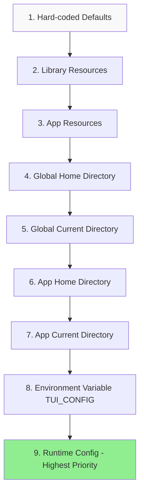

# Configuration Management Deep Dive

Terminal.Gui provides a comprehensive configuration system that allows users and developers to customize application behavior and appearance through JSON configuration files. The [ConfigurationManager](~/api/Terminal.Gui.Configuration.ConfigurationManager.yml) enables persistent settings, themes, and application-specific preferences.

## Table of Contents

- [Overview](#overview)
- [Getting Started](#getting-started)
- [Configuration Scopes](#configuration-scopes)
- [Configuration Locations and Precedence](#configuration-locations-and-precedence)
- [Themes and Schemes](#themes-and-schemes)
- [Defining Configuration Properties](#defining-configuration-properties)
- [Loading and Applying Configuration](#loading-and-applying-configuration)
- [Events](#events)
- [What Can Be Configured](#what-can-be-configured)
- [Configuration File Format](#configuration-file-format)
- [Best Practices](#best-practices)

---

## Overview

The [ConfigurationManager](~/api/Terminal.Gui.Configuration.ConfigurationManager.yml) provides:

- **Persistent Settings** - User preferences stored in JSON files
- **Theme System** - Named collections of visual settings
- **Scheme Management** - Color and text style definitions
- **Configuration Precedence** - Layered configuration from multiple sources
- **Runtime Configuration** - In-memory configuration without files
- **AOT Compatible** - Works with Native AOT compilation

### Key Features

- JSON-based configuration with schema validation
- Multiple configuration locations (user home, app directory, resources)
- Process-wide settings using static properties
- Built-in themes (Default, Dark, Light, etc.)
- Custom glyphs and Unicode characters
- Event-driven configuration changes

---

## Getting Started

### Enabling Configuration

**ConfigurationManager is disabled by default** and must be explicitly enabled:

```csharp
using Terminal.Gui.Configuration;

class Program
{
    static void Main()
    {
        // Enable configuration with all sources
        ConfigurationManager.Enable(ConfigLocations.All);

        using IApplication app = Application.Create();
        app.Init();
        // ... rest of app
    }
}
```

### Quick Example

```csharp
// Enable configuration
ConfigurationManager.Enable(ConfigLocations.All);

// Listen for configuration changes
ConfigurationManager.Applied += (sender, e) => 
{
    Console.WriteLine("Configuration applied!");
};

// Switch themes
ThemeManager.Theme = "Dark";
ConfigurationManager.Apply();
```

---

## Configuration Scopes

Terminal.Gui uses three configuration scopes, each serving a different purpose:

### 1. SettingsScope

System-level settings that affect Terminal.Gui behavior. Only Terminal.Gui library developers can define [SettingsScope](~/api/Terminal.Gui.Configuration.SettingsScope.yml) properties.

```csharp
[ConfigurationProperty(Scope = typeof(SettingsScope))]
public static bool Force16Colors { get; set; } = false;
```

**Examples:**
- `Application.QuitKey` - Default key to quit applications
- `Application.Force16Colors` - Force 16-color mode
- `Key.Separator` - Character separating keys in key combinations

### 2. ThemeScope

Visual appearance settings that can be themed. Only Terminal.Gui library developers can define [ThemeScope](~/api/Terminal.Gui.Configuration.ThemeScope.yml) properties.

```csharp
[ConfigurationProperty(Scope = typeof(ThemeScope))]
public static LineStyle DefaultBorderStyle { get; set; } = LineStyle.Single;
```

**Examples:**
- `Window.DefaultBorderStyle` - Default border style for windows
- `Dialog.DefaultShadow` - Default shadow style for dialogs
- `Schemes` - Color schemes for the theme

### 3. AppSettingsScope (Default)

Application-specific settings. Application developers can define [AppSettingsScope](~/api/Terminal.Gui.Configuration.AppSettingsScope.yml) properties for their apps.

```csharp
[ConfigurationProperty] // AppSettingsScope is default
public static string MyAppSetting { get; set; } = "default value";
```

**Important:** 
- App developers **cannot** define `SettingsScope` or `ThemeScope` properties
- AppSettings property names must be globally unique (automatically prefixed with class name)

---

## Configuration Locations and Precedence

Configuration is loaded from multiple locations with increasing precedence (higher numbers override lower):

### ConfigLocations Enum

[ConfigLocations](~/api/Terminal.Gui.Configuration.ConfigLocations.yml) specifies where configuration can be loaded from:

1. **[ConfigLocations.HardCoded](~/api/Terminal.Gui.Configuration.ConfigLocations.yml)** (Lowest Precedence)
   - Default values in code (static property initializers)
   - Always available, even when ConfigurationManager is disabled

2. **[ConfigLocations.LibraryResources](~/api/Terminal.Gui.Configuration.ConfigLocations.yml)**
   - Settings in `Terminal.Gui.dll` resources (`Terminal.Gui.Resources.config.json`)
   - Defines default themes and settings for the library

3. **[ConfigLocations.AppResources](~/api/Terminal.Gui.Configuration.ConfigLocations.yml)**
   - App-specific resources (`MyApp.Resources.config.json` or `Resources/config.json`)
   - Embedded in the application assembly

4. **[ConfigLocations.GlobalHome](~/api/Terminal.Gui.Configuration.ConfigLocations.yml)**
   - Global file in user's home directory (`~/.tui/config.json`)

5. **[ConfigLocations.GlobalCurrent](~/api/Terminal.Gui.Configuration.ConfigLocations.yml)**
   - Global file in current directory (`./.tui/config.json`)

6. **[ConfigLocations.AppHome](~/api/Terminal.Gui.Configuration.ConfigLocations.yml)**
   - App-specific file in user's home directory (`~/.tui/MyApp.config.json`)

7. **[ConfigLocations.AppCurrent](~/api/Terminal.Gui.Configuration.ConfigLocations.yml)**
   - App-specific file in current directory (`./.tui/MyApp.config.json`)

8. **[ConfigLocations.Env](~/api/Terminal.Gui.Configuration.ConfigLocations.yml)**
   - Settings from the `TUI_CONFIG` environment variable
   - Useful for container environments and CI/CD pipelines

9. **[ConfigLocations.Runtime](~/api/Terminal.Gui.Configuration.ConfigLocations.yml)** (Highest Precedence)
   - Settings in <xref:Terminal.Gui.Configuration.ConfigurationManager.RuntimeConfig> string property
   - In-memory configuration without files

### Precedence Diagram



### File Locations

**Global Settings** (`config.json`):
- Windows: `C:\Users\username\.tui\config.json`
- macOS/Linux: `~/.tui/config.json` or `./.tui/config.json`

**App-Specific Settings** (`AppName.config.json`):
- Windows: `C:\Users\username\.tui\UICatalog.config.json`
- macOS/Linux: `~/.tui/UICatalog.config.json` or `./.tui/UICatalog.config.json`

**Environment Variable** (`TUI_CONFIG`):
```bash
# Linux/macOS
export TUI_CONFIG='{"Application.QuitKey": "Ctrl+Q"}'

# Windows PowerShell
$env:TUI_CONFIG='{"Application.QuitKey": "Ctrl+Q"}'
```

---

## Themes and Schemes

### Theme System

A **Theme** is a named collection of visual settings bundled together. Terminal.Gui includes several built-in themes.

#### Built-in Themes

- **Default** - The default Terminal.Gui theme (matches hard-coded defaults)
- **Dark** - Dark color scheme with heavy borders
- **Light** - Light color scheme
- **TurboPascal 5** - Classic Turbo Pascal IDE colors
- **And more** - See `Terminal.Gui/Resources/config.json` for all built-in themes

#### Using Themes

```csharp
// Get current theme
ThemeScope currentTheme = ThemeManager.GetCurrentTheme();

// Get all available themes
Dictionary<string, ThemeScope> themes = ThemeManager.GetThemes();

// Get theme names
ImmutableList<string> themeNames = ThemeManager.GetThemeNames();

// Switch themes
ThemeManager.Theme = "Dark";
ConfigurationManager.Apply();

// Listen for theme changes
ThemeManager.ThemeChanged += (sender, e) => 
{
    // Update UI based on new theme
};
```

### Scheme System

A **Scheme** defines the colors and text styles for a specific UI context (e.g., Dialog, Menu, Runnable).

See the [Scheme Deep Dive](scheme.md) for complete details on the scheme system.

#### Built-in Schemes

[Schemes](~/api/Terminal.Gui.Drawing.Schemes.yml) enum defines the standard schemes:

- **Runnable** - Top-level application windows
- **Base** - Default for most views
- **Dialog** - Dialogs and message boxes
- **Menu** - Menus and status bars
- **Error** - Error messages and dialogs

#### Working with Schemes

```csharp
// Get all schemes for current theme
Dictionary<string, Scheme> schemes = SchemeManager.GetCurrentSchemes();

// Get specific scheme
Scheme dialogScheme = SchemeManager.GetScheme(Schemes.Dialog);

// Get scheme names
ImmutableList<string> schemeNames = SchemeManager.GetSchemeNames();

// Add custom scheme
SchemeManager.AddScheme("MyScheme", new Scheme
{
    Normal = new Attribute(Color.White, Color.Blue),
    Focus = new Attribute(Color.Black, Color.Cyan)
});

// Listen for scheme changes
SchemeManager.CollectionChanged += (sender, e) => 
{
    // Handle scheme changes
};
```

#### Scheme Structure

Each [Scheme](~/api/Terminal.Gui.Drawing.Scheme.yml) maps [VisualRole](~/api/Terminal.Gui.Drawing.VisualRole.yml) to [Attribute](~/api/Terminal.Gui.Drawing.Attribute.yml):

```json
{
  "Runnable": {
    "Normal": {
      "Foreground": "BrightGreen",
      "Background": "Black",
      "Style": "None"
    },
    "Focus": {
      "Foreground": "White",
      "Background": "Cyan",
      "Style": "Bold"
    },
    "HotNormal": {
      "Foreground": "Yellow",
      "Background": "Black"
    },
    "HotFocus": {
      "Foreground": "Blue",
      "Background": "Cyan",
      "Style": "Underline"
    },
    "Disabled": {
      "Foreground": "DarkGray",
      "Background": "Black",
      "Style": "Faint"
    }
  }
}
```

---

## Defining Configuration Properties

### Basic Property Definition

Application developers define settings using the [ConfigurationPropertyAttribute](~/api/Terminal.Gui.Configuration.ConfigurationPropertyAttribute.yml):

```csharp
public class MyApp
{
    [ConfigurationProperty]
    public static string MySetting { get; set; } = "Default Value";
    
    [ConfigurationProperty]
    public static int MaxItems { get; set; } = 100;
}
```

**Requirements:**
- Must be `public` or `internal`
- Must be `static`
- Must be a property (not a field)
- Must have a default value

### Property Naming

AppSettings properties are automatically prefixed with the class name to ensure global uniqueness:

```csharp
// Code
public class MyApp
{
    [ConfigurationProperty]
    public static string MySetting { get; set; } = "value";
}

// JSON
{
  "AppSettings": {
    "MyApp.MySetting": "value"
  }
}
```

### Scope Specification

Use the `Scope` parameter to specify non-default scopes (Terminal.Gui library only):

```csharp
// SettingsScope - Library-wide settings
[ConfigurationProperty(Scope = typeof(SettingsScope))]
public static bool Force16Colors { get; set; } = false;

// ThemeScope - Visual settings
[ConfigurationProperty(Scope = typeof(ThemeScope))]
public static LineStyle DefaultBorderStyle { get; set; } = LineStyle.Single;

// AppSettingsScope - Application settings (default)
[ConfigurationProperty] // or explicitly: Scope = typeof(AppSettingsScope)
public static string MyAppSetting { get; set; } = "default";
```

### Omit Class Name (Advanced)

For library developers only, use `OmitClassName = true` for cleaner JSON:

```csharp
[ConfigurationProperty(Scope = typeof(ThemeScope), OmitClassName = true)]
public static Dictionary<string, Scheme> Schemes { get; set; } = new();
```

---

## Loading and Applying Configuration

### Enable with Load and Apply

The simplest approach - enable and load in one call:

```csharp
ConfigurationManager.Enable(ConfigLocations.All);
```

This:
1. Enables ConfigurationManager
2. Loads configuration from all locations
3. Applies settings to the application

### Granular Control

For more control, use ConfigurationManager.Load and <xref:Terminal.Gui.Configuration.ConfigurationManager.Apply> separately:

```csharp
// Enable without loading
ConfigurationManager.Enable(ConfigLocations.None);

// Load from specific locations
ConfigurationManager.Load(ConfigLocations.GlobalHome | ConfigLocations.AppResources);

// Apply settings
ConfigurationManager.Apply();
```

### Runtime Configuration

Set configuration directly in code without files:

```csharp
ConfigurationManager.RuntimeConfig = @"
{
  ""Application.QuitKey"": ""Ctrl+Q"",
  ""Application.Force16Colors"": true
}";

ConfigurationManager.Enable(ConfigLocations.Runtime);
```

### Reset to Defaults

Reset all settings to hard-coded defaults:

```csharp
ConfigurationManager.ResetToHardCodedDefaults();
```

---

## Events

The ConfigurationManager provides events to track configuration changes:

### Applied Event

Raised after configuration is applied to the application:

```csharp
ConfigurationManager.Applied += (sender, e) => 
{
    // Configuration has been applied
    // Update UI or refresh views
};
```

### ThemeChanged Event

Raised when the active theme changes:

```csharp
ThemeManager.ThemeChanged += (sender, e) => 
{
    // Theme has changed
    // Refresh all views to use new theme
    // From within a View, use: App?.Current?.SetNeedsDraw();
    // Or access via IApplication instance: app.Current?.SetNeedsDraw();
};
```

### CollectionChanged Event

Raised when schemes collection changes:

```csharp
SchemeManager.CollectionChanged += (sender, e) => 
{
    // Schemes have changed
};
```

---

## What Can Be Configured

### Application Settings

System-wide settings from [SettingsScope](~/api/Terminal.Gui.Configuration.SettingsScope.yml):

```json
{
  "Application.QuitKey": "Esc",
  "Application.Force16Colors": false,
  "Application.IsMouseDisabled": false,
  "Application.ArrangeKey": "Ctrl+F5",
  "IKeyboard.NextTabKey": "Tab",
  "IKeyboard.PrevTabKey": "Shift+Tab",
  "IKeyboard.NextTabGroupKey": "F6",
  "IKeyboard.PrevTabGroupKey": "Shift+F6",
  "Key.Separator": "+"
}
```

### View-Specific Settings

Settings for individual View types from [ThemeScope](~/api/Terminal.Gui.Configuration.ThemeScope.yml):

```json
{
  "Window.DefaultBorderStyle": "Single",
  "Window.DefaultShadow": "None",
  "Dialog.DefaultBorderStyle": "Heavy",
  "Dialog.DefaultShadow": "Transparent",
  "Dialog.DefaultButtonAlignment": "End",
  "FrameView.DefaultBorderStyle": "Rounded",
  "Button.DefaultShadow": "None",
  "PopoverMenu.DefaultKey": "Shift+F10",
  "FileDialog.MaxSearchResults": 10000
}
```

### Glyphs

Customize the Unicode characters used for drawing:

```json
{
  "Glyphs.RightArrow": "►",
  "Glyphs.LeftArrow": "U+25C4",
  "Glyphs.DownArrow": "\\u25BC",
  "Glyphs.UpArrow": 965010,
  "Glyphs.LeftBracket": "[",
  "Glyphs.RightBracket": "]",
  "Glyphs.Checked": "☑",
  "Glyphs.UnChecked": "☐",
  "Glyphs.Selected": "◉",
  "Glyphs.UnSelected": "○"
}
```

Glyphs can be specified as:
- Unicode character: `"►"`
- U+ format: `"U+25C4"`
- UTF-16 format: `"\\u25BC"`
- Decimal codepoint: `965010`

### Discovering Configuration Properties

To find all available configuration properties:

```csharp
// Get hard-coded configuration
SettingsScope hardCoded = ConfigurationManager.GetHardCodedConfig();

// Iterate through all properties
foreach (var property in hardCoded)
{
    Console.WriteLine($"{property.Key} = {property.Value}");
}
```

Or search the source code for `[ConfigurationProperty]` attributes.

---

## Themes and Schemes

### Theme Structure

A theme is a named collection bundling visual settings and schemes:

```json
{
  "Themes": [
    {
      "Dark": {
        "Dialog.DefaultBorderStyle": "Heavy",
        "Dialog.DefaultShadow": "Transparent",
        "Window.DefaultBorderStyle": "Single",
        "Button.DefaultShadow": "Opaque",
        "Schemes": [
          {
            "Runnable": {
              "Normal": { "Foreground": "BrightGreen", "Background": "Black" },
              "Focus": { "Foreground": "White", "Background": "Cyan" }
            },
            "Dialog": {
              "Normal": { "Foreground": "Black", "Background": "Gray" }
            }
          }
        ]
      }
    }
  ]
}
```

### Creating Custom Themes

Custom themes can be defined in configuration files:

```json
{
  "Themes": [
    {
      "MyCustomTheme": {
        "Window.DefaultBorderStyle": "Double",
        "Dialog.DefaultShadow": "Opaque",
        "Schemes": [
          {
            "Base": {
              "Normal": {
                "Foreground": "Cyan",
                "Background": "Black",
                "Style": "Bold"
              }
            }
          }
        ]
      }
    }
  ]
}
```

Then activate the theme:

```csharp
ThemeManager.Theme = "MyCustomTheme";
ConfigurationManager.Apply();
```

### Theme Inheritance

Themes only override specified properties. To build on an existing theme:

```csharp
// Start with default theme
ThemeManager.Theme = "Default";
ConfigurationManager.Apply();

// Apply custom theme (overrides only what's specified)
ThemeManager.Theme = "MyCustomTheme";
ConfigurationManager.Apply();
```

### TextStyle in Schemes

Each [Attribute](~/api/Terminal.Gui.Drawing.Attribute.yml) in a scheme now includes [TextStyle](~/api/Terminal.Gui.Drawing.TextStyle.yml):

```json
{
  "Normal": {
    "Foreground": "White",
    "Background": "Blue",
    "Style": "Bold, Underline"
  }
}
```

Available styles (combinable):
- `None`
- `Bold`
- `Faint`
- `Italic`
- `Underline`
- `Blink`
- `Reverse`
- `Strikethrough`

---

## Configuration File Format

### Schema

All configuration files must conform to the JSON schema:

**Schema URL:** https://gui-cs.github.io/Terminal.Gui/schemas/tui-config-schema.json

### Root Structure

```json
{
  "$schema": "https://gui-cs.github.io/Terminal.Gui/schemas/tui-config-schema.json",
  
  // SettingsScope properties
  "Application.QuitKey": "Esc",
  "Application.Force16Colors": false,
  
  // Current theme name
  "Theme": "Dark",
  
  // Theme definitions
  "Themes": [
    {
      "Dark": {
        // ThemeScope properties
        "Window.DefaultBorderStyle": "Single",
        // Schemes
        "Schemes": [ ... ]
      }
    }
  ],
  
  // AppSettings
  "AppSettings": {
    "MyApp.MySetting": "value"
  }
}
```

## Best Practices

### For Application Developers

**1. Enable Early**

Enable ConfigurationManager at the start of `Main()`, before creating the application:

```csharp
static void Main()
{
    ConfigurationManager.Enable(ConfigLocations.All);
    using IApplication app = Application.Create();
    app.Init();
    // ...
}
```

**2. Use AppSettings for App Configuration**

```csharp
public class MyApp
{
    [ConfigurationProperty]
    public static bool ShowWelcomeMessage { get; set; } = true;
    
    [ConfigurationProperty]
    public static string DefaultDirectory { get; set; } = "";
}
```

**3. Ship Default Configuration as Resource**

Include a `Resources/config.json` file in your app:

```xml
<ItemGroup>
  <EmbeddedResource Include="Resources\config.json" />
</ItemGroup>
```

**4. Handle Configuration Changes**

```csharp
ConfigurationManager.Applied += (sender, e) => 
{
    // Refresh UI when configuration changes
    RefreshAllViews();
};
```

### For Library Developers

**1. Use Appropriate Scopes**

- `SettingsScope` - For system-wide behavior
- `ThemeScope` - For visual appearance that should be themeable
- Don't use `AppSettingsScope` in library code

**2. Provide Meaningful Defaults**

```csharp
[ConfigurationProperty(Scope = typeof(ThemeScope))]
public static LineStyle DefaultBorderStyle { get; set; } = LineStyle.Single;
```

**3. Document Configuration Properties**

```csharp
/// <summary>
///     Gets or sets the default border style for all Windows.
/// </summary>
[ConfigurationProperty(Scope = typeof(ThemeScope))]
public static LineStyle DefaultBorderStyle { get; set; } = LineStyle.Single;
```

### Process-Wide Settings

> [!IMPORTANT]
> Configuration settings are applied at the **process level**. 
> 
> Since configuration properties are static, changes affect all applications in the same process. This is typically not an issue for normal applications, but can affect scenarios with:
> - Multiple Terminal.Gui apps in the same process
> - Unit tests running in parallel
> - Hot reload scenarios

---

## Advanced Topics

### JSON Error Handling

Control how JSON parsing errors are handled:

```json
{
  "ConfigurationManager.ThrowOnJsonErrors": true
}
```

- `false` (default) - Silent failures, errors logged
- `true` - Throws exceptions on JSON parsing errors

### Manually Trigger Updates

Update ConfigurationManager to reflect current static property values:

```csharp
// Change a setting programmatically
Application.QuitKey = Key.Q.WithCtrl;

// Update ConfigurationManager to reflect the change
ConfigurationManager.UpdateToCurrentValues();

// Save to file (if needed)
string json = ConfigurationManager.Serialize();
File.WriteAllText("my-config.json", json);
```

### Disable ConfigurationManager

Disable and optionally reset to defaults:

```csharp
// Disable but keep current settings
ConfigurationManager.Disable(resetToHardCodedDefaults: false);

// Disable and reset to hard-coded defaults
ConfigurationManager.Disable(resetToHardCodedDefaults: true);
```

### File System Watching

Watch for configuration file changes:

```csharp
var watcher = new FileSystemWatcher(
    Path.Combine(Environment.GetFolderPath(Environment.SpecialFolder.UserProfile), ".tui"));
watcher.Filter = "*.json";
watcher.Changed += (s, e) => 
{
    ConfigurationManager.Load(ConfigLocations.GlobalHome);
    ConfigurationManager.Apply();
};
watcher.EnableRaisingEvents = true;
```

See UICatalog's `ConfigurationEditor` scenario for a complete example.

---

## Examples

### Example 1: Simple Theme Switching

```csharp
using Terminal.Gui;
using Terminal.Gui.Configuration;

ConfigurationManager.Enable(ConfigLocations.All);
Application.Init();

var themeSelector = new ComboBox
{
    X = 1,
    Y = 1,
    Width = 20
};
themeSelector.SetSource(ThemeManager.GetThemeNames());
themeSelector.SelectedItemChanged += (s, e) =>
{
    ThemeManager.Theme = e.Value.ToString();
    ConfigurationManager.Apply();
};

Application.Run(new Window { Title = "Theme Demo" }).Add(themeSelector);
Application.Shutdown();
```

### Example 2: Custom Application Settings

```csharp
public class MyApp
{
    [ConfigurationProperty]
    public static string LastOpenedFile { get; set; } = "";
    
    [ConfigurationProperty]
    public static int WindowWidth { get; set; } = 80;
    
    [ConfigurationProperty]
    public static int WindowHeight { get; set; } = 25;
}

// Enable and use
ConfigurationManager.Enable(ConfigLocations.All);

// Settings are automatically loaded and applied
var window = new Window
{
    Width = MyApp.WindowWidth,
    Height = MyApp.WindowHeight
};

// Later, save updated settings
MyApp.WindowWidth = 100;
ConfigurationManager.UpdateToCurrentValues();
// Could save to file here
```

### Example 3: Runtime Configuration

```csharp
ConfigurationManager.RuntimeConfig = @"
{
  ""Application.QuitKey"": ""Ctrl+Q"",
  ""Application.Force16Colors"": true,
  ""Theme"": ""Dark""
}";

ConfigurationManager.Enable(ConfigLocations.Runtime);

// Settings are now applied
// QuitKey is Ctrl+Q
// 16-color mode is forced
// Dark theme is active
```

---

## See Also

- **[Scheme Deep Dive](scheme.md)** - Color scheme details
- **[Drawing Deep Dive](drawing.md)** - Color and attribute system
- **[View Deep Dive](View.md)** - View configuration properties
- **[Theme Schema](https://gui-cs.github.io/Terminal.Gui/schemas/tui-config-schema.json)** - JSON schema for validation
- **[Default Config](../../Terminal.Gui/Resources/config.json)** - Complete default configuration

### UICatalog Examples

The UICatalog application demonstrates configuration management:

- **Configuration Editor** - Interactive editor for configuration files
- **Themes** - Theme viewer and selector
- **File System Watcher** - Automatic reload on configuration file changes

### API Reference

- [ConfigurationManager](~/api/Terminal.Gui.Configuration.ConfigurationManager.yml)
- [ConfigLocations](~/api/Terminal.Gui.Configuration.ConfigLocations.yml)
- [SettingsScope](~/api/Terminal.Gui.Configuration.SettingsScope.yml)
- [ThemeScope](~/api/Terminal.Gui.Configuration.ThemeScope.yml)
- [AppSettingsScope](~/api/Terminal.Gui.Configuration.AppSettingsScope.yml)
- [ThemeManager](~/api/Terminal.Gui.Configuration.ThemeManager.yml)
- [SchemeManager](~/api/Terminal.Gui.Configuration.SchemeManager.yml)
- [ConfigurationPropertyAttribute](~/api/Terminal.Gui.Configuration.ConfigurationPropertyAttribute.yml)
